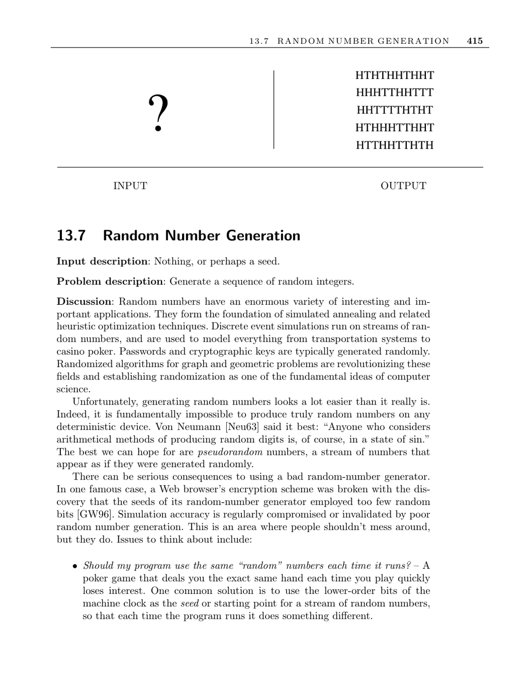

- **Random Number Generation**
  - **Input and Problem Description**
    - Input can be nothing or a seed for the random number generator.
    - The primary goal is to generate a sequence of random integers that appear randomly distributed.
    - Random numbers underpin a wide range of applications, including simulations, optimizations, and cryptography.
  - **Challenges and Considerations**
    - Truly random numbers cannot be produced on deterministic machines, necessitating pseudorandom generators.
    - Poor random number generators can compromise security and simulation accuracy.
    - Using the machine clock as a seed introduces variability but can cause periodicities and complicate debugging.
    - Retaining seeds across runs helps balance repeatability and randomness in debugging.
  - **Random Number Generator Quality**
    - Default compiler generators are convenient but may not be suitable for critical applications.
    - Proper testing using multiple statistical evaluations, such as those from NIST, is essential for reliable randomness.
    - Human intuition about randomness is often flawed, necessitating formal testing.
    - The NIST test suite provides a rigorous framework for validating random number generators ([NIST RNG Tests](http://csrc.nist.gov/rng/)).
  - **Linear Congruential Generators (LCG)**
    - The standard method for pseudorandom number generation uses the recurrence Rn = (aRn−1 + c) mod m.
    - Careful selection of constants a, c, m, and the seed R0 determines period length and randomness quality.
    - LCGs repeat their sequence when a previous number recurs, often making 32-bit implementations susceptible to cycling.
    - Scaling of LCG outputs can produce uniform distributions on any desired interval of integers or real numbers.
  - **Nonuniform Random Number Generation**
    - Nonuniform distributions require specialized methods like acceptance-rejection sampling.
    - The acceptance-rejection method selects random points within a bounding box and accepts those inside the target region.
    - Nonuniform methods can be inefficient if the target region is small relative to the bounding box.
    - Simple incorrect methods, such as uniform sampling of polar coordinates, can skew distributions subtly.
  - **Monte Carlo Simulation Considerations**
    - Longer simulation runs improve accuracy only up to the random number generator's period length.
    - Multiple shorter runs with different seeds are preferable to one long run to assess result variance and repeatability.
  - **Implementations and Resources**
    - Excellent resources and implementations are available online, including parallel random number generators ([University of Montreal Streams](http://www.iro.umontreal.ca/~lecuyer/myftp/streams00/), [SPRNG](http://sprng.cs.fsu.edu/)).
    - ACM Collected Algorithms provide Fortran codes for nonuniform distributions.
    - The NIST statistical test suite is the definitive tool for RNG validation ([NIST RNG Tests](http://csrc.nist.gov/rng/)).
    - Atmospheric noise-based true random numbers can be accessed via [random.org](http://www.random.org).
  - **Further Notes and Theory**
    - Knuth’s comprehensive treatment covers theoretical and practical aspects of RNGs.
    - The Mersenne Twister is a modern, fast generator with a very long period (2^19937 − 1).
    - Kolmogorov complexity relates randomness to incompressibility and provides a theoretical framework.
    - Additional references include recent research articles and standard mathematical handbooks ([Knuth 1997b], [Mersenne Twister](https://www.math.sci.hiroshima-u.ac.jp/~m-mat/MT/emt.html)).
