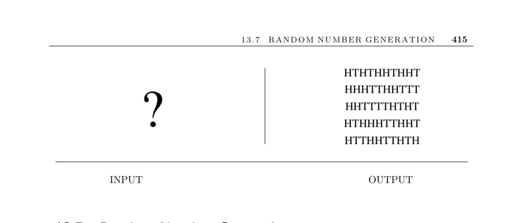

- **Random Number Generation**
  - **Input description**
    - The input may be empty or include a seed for initializing random number generation.
    - Seeds influence the reproducibility and variability of generated sequences.
    - Proper seed choice impacts random sequence distinctness each run.
  - **Problem description**
    - The task is to generate a sequence of random integers.
    - Random numbers support diverse applications like optimization, simulation, and cryptography.
  - **Discussion**
    - Truly random numbers cannot be produced deterministically; pseudorandom numbers approximate randomness.
    - Poor random-number generators can compromise security and simulation accuracy.
    - Von Neumann famously criticized arithmetic pseudo-random methods as flawed.
    - Use of time-based or varied seeds can produce different sequences across runs.
    - Debugging benefits from repeatability via fixed or recorded seeds.
    - Compiler built-in generators vary in quality and should be tested for critical applications.
    - The linear congruential generator (LCG) is a standard, efficient algorithm defined by \( R_n = (aR_{n-1} + c) \mod m \).
    - LCGs have limited period length tied to modulus \( m \) and may cycle quickly on 32-bit machines.
    - Uniformly scaling LCG outputs enables generation of random real numbers and integers within ranges.
    - Nonuniform random variables can be generated using acceptance-rejection methods.
    - Naive methods for uniform sampling in geometric shapes can introduce bias.
    - Monte Carlo simulations gain accuracy with longer runs but should avoid exceeding random generator periods.
    - Multiple shorter simulation runs with different seeds improve result reliability and variance estimation.
  - **Implementations and Resources**
    - Comprehensive collections and implementations are available at [random.mat.sbg.ac.at](http://random.mat.sbg.ac.at).
    - Parallel random number streams can be managed with generators from [L'Ecuyer's site](http://www.iro.umontreal.ca/~lecuyer/myftp/streams00/) and [SPRNG library](http://sprng.cs.fsu.edu/).
    - Non-uniform generators for common distributions exist as ACM Collected Algorithms via Netlib.
    - The NIST statistical test suite validates random number generator quality at [nist.gov](http://csrc.nist.gov/rng/).
    - True random numbers can be sourced from physical phenomena, e.g., [random.org](http://www.random.org).
  - **Notes and Further Reading**
    - Knuth provides foundational theory and testing methods for random generators in [The Art of Computer Programming](https://www-cs-faculty.stanford.edu/~knuth/taocp.html).
    - The Mersenne Twister algorithm offers a long-period, high-quality generator.
    - Surveys and comparisons of various generators appear in [Gen04], [MN98], [Den05], [PLM06], and [PM88].
    - Table of pre-generated random digits is available from [RC55].
    - Kolmogorov complexity theory relates randomness to incompressibility of strings; see [LV97].
