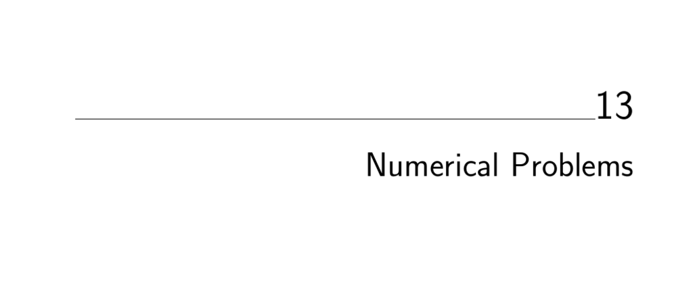

- **Numerical Problems**
  - **Solving Linear Equations**
    - Linear systems solve A·x = b for vector x given matrix A and vector b.  
    - Gaussian elimination is the basic cubic-time algorithm, improved by LU-decomposition for efficiency.  
    - Issues include numerical stability, roundoff errors, sparsity, and leveraging special matrix types.  
    - The recommended software is LAPACK and its variants; see [LAPACK](http://www.netlib.org/lapack).  
  - **Bandwidth Reduction**
    - Bandwidth reduction minimizes max edge length after permuting vertices of a graph or matrix rows/columns.  
    - It is NP-complete, even for degree-3 trees, necessitating heuristics like Cuthill-McKee and Gibbs-Poole-Stockmeyer.  
    - Heuristics use breadth-first search ordering from varying start vertices and tie-break rules.  
    - Implementations available in Fortran on Netlib; see [Del Corso and Manzini bandwidth code](http://www.mfn.unipmn.it/~manzini/bandmin).  
  - **Matrix Multiplication**
    - Matrix multiplication computes product of matrices A (x×y) and B (y×z) in O(xyz) time by nested loops.  
    - Strassen’s algorithm and its variants improve asymptotic complexity but are less stable and practical only for large matrices.  
    - Matrix-chain multiplication optimizes parentheses for minimal computation cost.  
    - Matrix powers count paths in graphs; Boolean matrix multiplication relates to general matrix multiplication.  
    - See [FFTW](http://www.fft.org) and LAPACK for practical implementations.  
  - **Determinants and Permanents**
    - Determinants test matrix singularity and geometric properties; computable in O(n³) via LU-decomposition.  
    - Permanents count combinatorial structures like perfect matchings but are #P-complete and much harder to compute.  
    - Fast determinant computation relates to matrix multiplication speed; permanents can be approximated probabilistically.  
    - Libraries include LINPACK, JScience, and Nijenhuis-Wilf permanent algorithms.  
  - **Constrained and Unconstrained Optimization**
    - Optimization finds maxima or minima of function f(x₁,..,xₙ), possibly under constraints.  
    - Unconstrained problems rely on derivatives and local search; constrained problems employ penalties and simulated annealing.  
    - Dimensionality, smoothness, and cost of function evaluation influence method choice.  
    - Recommended resources include Hans Mittlemann’s optimization software guide and NEOS service.  
  - **Linear Programming**
    - Linear programming maximizes/minimizes a linear function subject to linear inequalities.  
    - The simplex method is widely used, with interior-point methods as alternatives.  
    - Integer and mixed-integer constraints make problems NP-complete but solvable in practice via cutting planes.  
    - Software includes lp_solve, CLP, GLPK, and commercial packages; see [lp_solve](http://lpsolve.sourceforge.net).  
  - **Random Number Generation**
    - True randomness is impossible on deterministic machines; pseudorandom generators approximate randomness.  
    - The linear congruential generator is standard but must be properly parameterized to avoid short cycles.  
    - Nonuniform distributions use acceptance-rejection; caution necessary to ensure correct distributions.  
    - Parallel simulations need independent streams; NIST provides statistical test suites for RNGs.  
    - See [NIST RNG Test Suite](http://csrc.nist.gov/rng/) and Knuth’s treatment in [The Art of Computer Programming](https://www-cs-faculty.stanford.edu/~knuth/).  
  - **Factoring and Primality Testing**
    - Trial division runs in O(√n) but is exponential in input size; faster randomized algorithms test compositeness efficiently.  
    - Integer factorization underlies RSA cryptography; number field sieve is the fastest known factoring method.  
    - Primality tests include Fermat’s theorem and Miller-Rabin; distribution of primes follows the prime number theorem.  
    - Libraries: PARI, LiDIA, NTL, MIRACL; see [PARI/GP](http://pari.math.u-bordeaux.fr).  
  - **Arbitrary-Precision Arithmetic**
    - High-precision arithmetic extends integer/real computations beyond hardware limits using arrays or lists of digits.  
    - Algorithms include schoolbook addition, Karatsuba multiplication (O(n¹˙⁵⁹)), long division, and divide-and-conquer exponentiation.  
    - Higher base representation improves performance; Chinese remainder theorem enables parallel computations.  
    - GMP and Java BigInteger offer robust libraries; see [GMP](http://gmplib.org).  
  - **Knapsack Problem**
    - The 0/1 knapsack maximizes value subject to capacity constraints, requiring subset selection.  
    - Special cases with uniform size or value simplify; subset sum and integer partition are NP-complete variants.  
    - Dynamic programming solves knapsack in O(nC) time for integer capacities; heuristics include greedy and scaling.  
    - Implementations: Martello and Toth Fortran codes, David Pisinger’s C codes; see [Martello and Toth](http://www.or.deis.unibo.it/kp.html).  
  - **Discrete Fourier Transform**
    - The discrete Fourier transform (DFT) converts time-domain sequences into frequency domain, enabling filtering, compression, and convolution.  
    - The FFT algorithm computes the DFT in O(n log n) time, usually requiring n to be a power of two.  
    - Applications include signal processing, correlation, image filtering, and polynomial multiplication.  
    - Leading libraries: FFTW and FFTPACK; see [FFTW](http://www.fftw.org).
