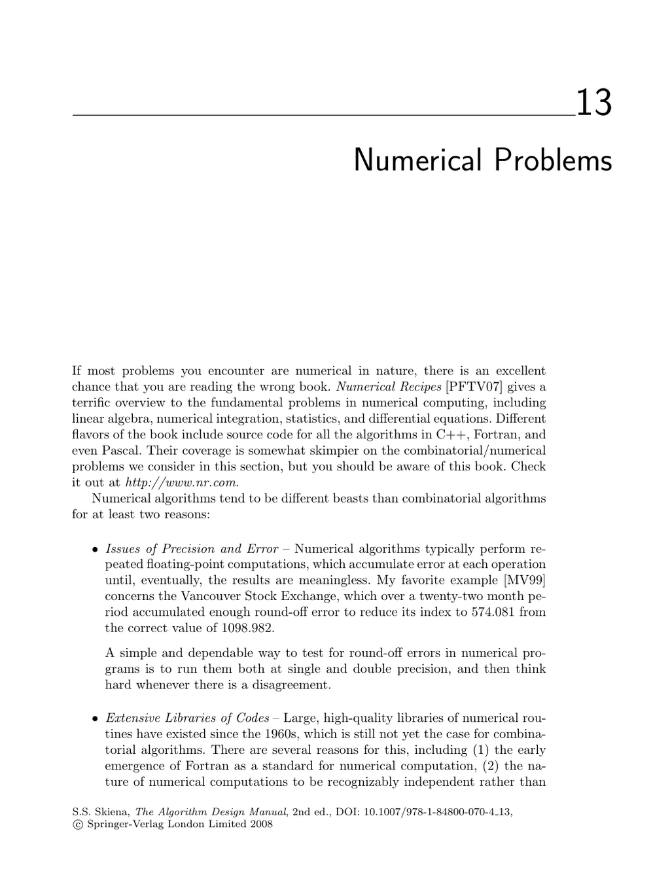

- **Numerical Problems**
  - **Solving Linear Equations**
    - The problem involves finding vector x such that A·x = b for given matrix A and vector b.
    - Gaussian elimination is the fundamental solution method but requires pivoting to manage roundoff errors.
    - LU-decomposition enables efficient repeated solving of systems with the same coefficient matrix.
    - Large, high-quality libraries such as LAPACK exist for solving linear systems.
    - See [Golub and van Loan, 1996] for comprehensive coverage.
  - **Bandwidth Reduction**
    - Bandwidth reduction permutes a sparse matrix to minimize the distance of non-zero elements from the diagonal.
    - The problem is NP-complete, even for trees of maximum degree 3.
    - Heuristics like Cuthill-McKee and Gibbs-Poole-Stockmeyer algorithms offer practical approximations.
    - Implementations are available from Netlib and related sources.
    - Refer to [Diaz et al., 2002] for a survey on algorithms.
  - **Matrix Multiplication**
    - Computes product of matrices A (x×y) and B (y×z) yielding an x×z matrix.
    - The straightforward cubic-time algorithm is typically preferred unless matrices are very large.
    - Strassen’s O(n^2.81) algorithm and subsequent improvements offer faster theoretical methods.
    - Matrix multiplication is central to various problems including graph path counting and linear algebra.
    - The FFTW library is a leading implementation for large-scale multiplications (see FFTW).
  - **Determinants and Permanents**
    - The determinant tests matrix singularity, volume computations, and geometric properties.
    - Efficient O(n^3) determinant computation uses LU-decomposition.
    - The permanent is similar but NP-hard to compute; related to counting perfect matchings.
    - Faster permanent algorithms run in O(n^2 2^n) time, with approximation schemes also available.
    - Consult [Minc, 1978] for permanents and [LINPACK] for determinants.
  - **Constrained and Unconstrained Optimization**
    - Optimization problems seek points maximizing or minimizing functions possibly under constraints.
    - Unconstrained optimization can use derivative-based local search methods; constrained problems often require linear programming or heuristics.
    - Simulated annealing and genetic algorithms provide heuristic approaches to global optimization.
    - The NEOS server and algorithms from the Collected Algorithms of the ACM offer accessible implementations.
    - See [Numerical Recipes, 2007] for detailed algorithm descriptions.
  - **Linear Programming**
    - Solves optimization of a linear function subject to linear inequality constraints.
    - The simplex method is the standard approach, with interior-point methods as alternatives.
    - Integer programming variants are NP-complete but solvable in practice using cutting planes and branch-and-bound.
    - Duality principles allow reformulating problems based on variable and constraint counts.
    - Free solvers include lp_solve, CLP, and GLPK; see [plato.asu.edu] for guidance.
  - **Random Number Generation**
    - Produces pseudorandom sequences for simulations, cryptography, and randomized algorithms.
    - Linear congruential generators are standard but require carefully chosen parameters to avoid poor distributions and short periods.
    - Statistical tests such as the NIST suite validate the quality of generators.
    - Parallel and scalable generators exist for multi-processor environments.
    - Recommended resource: [Knuth, 1997] and [NIST RNG Test Suite](http://csrc.nist.gov/rng/).
  - **Factoring and Primality Testing**
    - Separates an integer into prime factors or tests its primality; important for cryptography and hashing.
    - Simple trial division is inefficient for large numbers; randomized algorithms and the number field sieve provide practical factorization.
    - Fermat's little theorem and Miller-Rabin tests enable fast probabilistic primality checks.
    - The Prime Number Theorem approximates the distribution of prime numbers.
    - Refer to [Crandall and Pomerance, 2005] for modern factoring algorithms.
  - **Arbitrary-Precision Arithmetic**
    - Supports arithmetic on integers larger than the machine’s native word size.
    - Implements basic operations (addition, subtraction, multiplication, division) via digit arrays or linked lists.
    - Karatsuba’s O(n^1.59) and FFT-based algorithms improve multiplication speed for large numbers.
    - Libraries include GMP for C/C++ and java.math.BigInteger for Java.
    - See [Knuth, 1997] for classic algorithm descriptions.
  - **Knapsack Problem**
    - Selects subset of items maximizing value without exceeding capacity; fundamental in resource allocation.
    - 0/1 knapsack prohibits fractional items, making the problem NP-complete.
    - Dynamic programming solutions run in O(nC) time when item sizes and capacity are small integers.
    - Heuristics and approximation schemes exist; special cases include subset sum and partition problems.
    - Implementations available from Martello and Toth and David Pisinger.
  - **Discrete Fourier Transform**
    - Transforms an n-point sequence from the time domain to the frequency domain.
    - Enables filtering, image compression, convolution, and correlation computations.
    - The fast Fourier transform (FFT) reduces complexity from O(n^2) to O(n log n).
    - FFT algorithms commonly require input sizes that are powers of two.
    - Leading implementations: FFTW and FFTPACK; see [Bracewell, 1999] for theory and applications.
