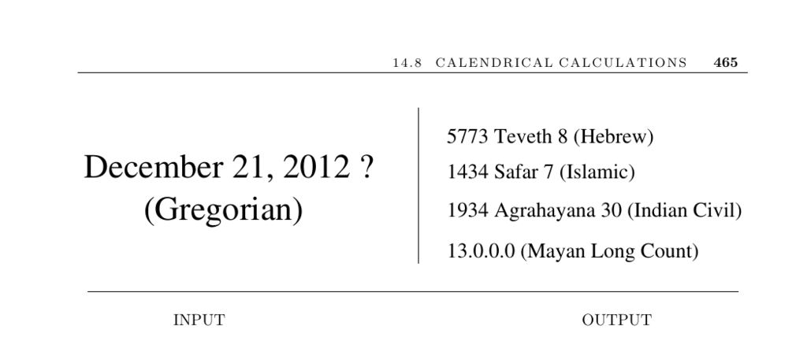

- **14.8 CALENDRICAL CALCULATIONS**
  - **Input description**
    - The input is a specific calendar date d, given by month, day, and year.
    - The problem is to determine the day of the week corresponding to d in the specified calendar system.
    - Many applications require accurate calendrical calculations for scheduling and event tracking.
  - **Problem description**
    - The main task is to identify which day of the week a particular date d fell on.
    - Calendrical calculations are crucial for business applications, such as futures contracts.
    - Different calendar systems need to be accounted for in international contexts.
  - **Discussion**
    - Calendar systems are historical artifacts, not purely mathematical constructs.
    - The core approach starts with a fixed reference date (epoch) and counts days forward.
    - Functions needed: one converting a date to elapsed days since the epoch, and one converting elapsed days back to a date.
  - **Complications in calendar systems**
    - The solar year is not an integer number of days, necessitating leap days.
    - The Julian calendar ignored fractional days causing drift over centuries.
    - The Gregorian reform corrected this by deleting 10 days and adjusting leap year rules.
    - Leap years are omitted for years divisible by 100 but not by 400 to improve accuracy.
  - **Implementation guidance**
    - Most calendar rules are complex, so reusing reliable code is advised.
    - Mental algorithms exist for day-of-week computations but lack broad reliability.
    - Reliable implementations exist in C++ (Boost time-data) and Java (java.util.Calendar).
  - **Existing algorithmic frameworks**
    - Dershowitz and Reingold provide a uniform algorithmic presentation for multiple calendar systems.
    - Their Calendrical package implements conversions, day computations, and holiday determinations.
    - The website [calendarists.com](http://calendarists.com) hosts this comprehensive resource.
  - **Additional resources**
    - Other calendar implementations with uncertain reliability are available on SourceForge.
    - The key references include Dershowitz and Reingold’s papers [DR90, RDC93] and their book [RD01].
    - A large tabulation of calendars for the years 1900 to 2200 is available in [DR02].
  - **Historical and cultural notes**
    - The Mayan calendar’s 13.0.0.0.0 rollover on December 21, 2012, caused public concern.
    - This date marks the completion of a 5,125-year cycle in the Mayan system.
    - The Mayan calendar is authoritatively described in [RD01].
  - **Related problems**
    - Calendrical calculations relate to arbitrary-precision arithmetic.
    - They also relate to generating permutations in combinatorial algorithms.
