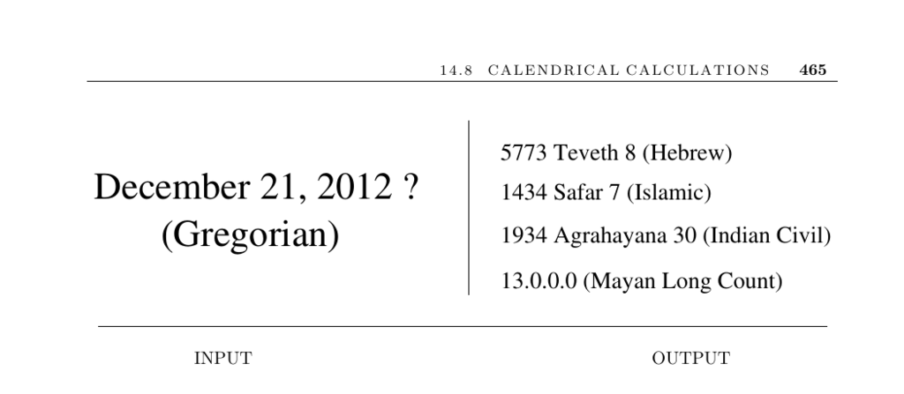

- **14.8 CALENDRICAL CALCULATIONS**  
  - **Input description**  
    - The input is a particular calendar date specified by month, day, and year.  
    - The problem is to determine the day of the week on which the given date falls according to the specified calendar system.  
    - Many business and historical applications require accurate calendrical calculations.  
  - **Discussion**  
    - Calendrical calculations require specifying and implementing calendar system rules correctly rather than finding computational shortcuts.  
    - Different calendar systems have unique rules for counting days, months, and years from their epoch dates.  
    - Leap days are added irregularly to keep calendars synchronized with the solar year, which is about 365 days and 5 hours 49 minutes long.  
    - The Gregorian calendar corrected the Julian calendar by removing 10 days in 1582 and changing leap year rules to improve accuracy.  
    - Resistance to calendar reforms caused delays in adoption in various countries.  
  - **Implementation considerations**  
    - Reliable calendar code should be reused rather than written from scratch due to complexity.  
    - Mental algorithms for day-of-week calculation exist but fail outside narrow ranges and should be avoided for programming.  
    - Libraries such as Boost (C++) and java.util.Calendar (Java) provide Gregorian calendar support.  
    - Dershowitz and Reingold provide comprehensive algorithms covering multiple calendar types including Gregorian, ISO, Chinese, Hindu, Islamic, and Hebrew.  
    - The Calendrical library implements these algorithms in Common Lisp, Java, and Mathematica with broad calendar support and conversion functions. ([calendarists.com](http://calendarists.com))  
  - **Notes and references**  
    - The main source for calendrical algorithms is the book by Dershowitz and Reingold [RD01], which covers 25 calendars with authoritative detail.  
    - Their research papers [DR90, RDC93] and tabulations from 1900 to 2200 [DR02] provide extensive historical calendar data.  
    - The Mayan calendar rollover on December 21, 2012 corresponds to cycle 13.0.0.0.0 after 5,125 years and is described authoritatively in [RD01].  
  - **Related Problems**  
    - This topic relates to arbitrary-precision arithmetic and permutation generation discussed in earlier sections.
