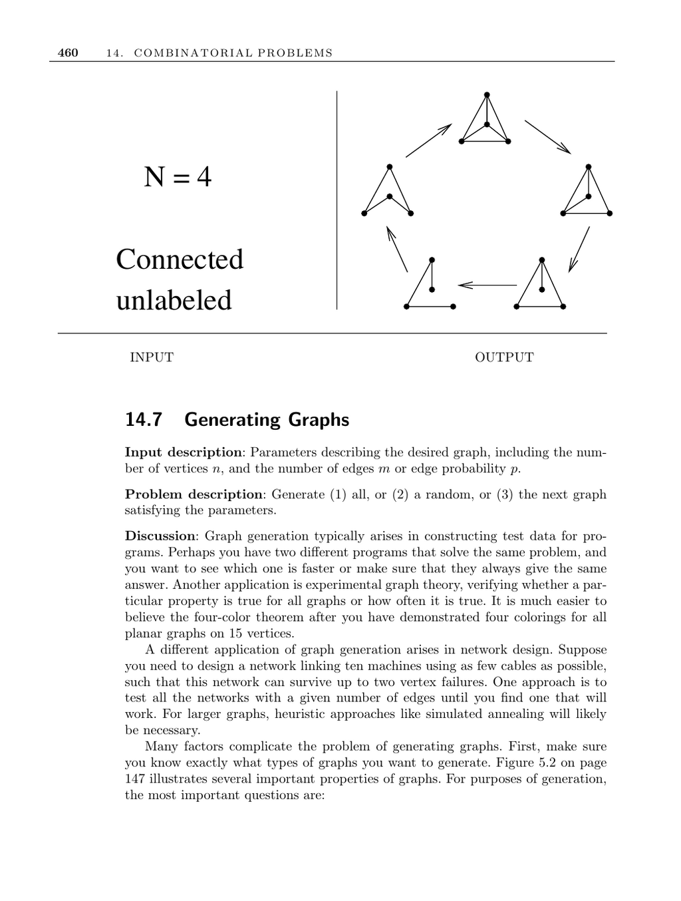

- **14.7 Generating Graphs**
  - The section describes methods to generate all, random, or the next graph with given parameters such as number of vertices and edges or edge probability.
  - Graph generation assists in testing programs, experimental graph theory, and network design scenarios requiring reliability under vertex failures.
  - Key generation considerations include whether graphs are labeled or unlabeled and directed or undirected, influencing enumeration and graph properties.
  - Random graph models covered are random edge generation (parameterized by edge probability p), random edge selection (parameterized by number of edges m), and preferential attachment (degree-based edge formation).
  - The section highlights that random graphs often lack real-world structural properties, suggesting "organic" graphs as more reflective of actual relationships.
  - Two specialized graph classes with generation algorithms are trees, using Prüfer codes for bijection between labeled trees and sequences, and fixed degree sequence graphs, using recursive constructions and edge-flipping operations.
  - The Stanford GraphBase, Combinatorica, the Combinatorial Object Server, and Nauty are prominent implementations and resources for graph generation.
  - [Knuth's The Art of Computer Programming, Volume 4A](https://cs.stanford.edu/~knuth/taocp.html) is a key reading for generating trees and related algorithms.
