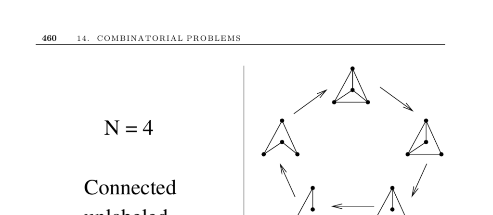

- **14.7 Generating Graphs**  
  - Parameters include the number of vertices \(n\) and either the number of edges \(m\) or edge probability \(p\).  
  - Generation options include producing all graphs, a random graph, or the next graph matching parameters.  
  - Applications involve test data construction, experimental graph theory, and network design.  
  - The Stanford GraphBase and Combinatorica provide implementations for graph generation.  
  - Further reading: [Stanford GraphBase](http://theory.stanford.edu/sgb/).

  - **Graph Labeling and Directionality**  
    - Labeled graphs distinguish vertex names; unlabeled graphs treat isomorphic graphs as identical.  
    - Undirected graph generation is common; directed graphs arise by orienting edges randomly or to ensure acyclicity.  
    - Generating all graphs uniformly at random requires careful consideration of labeling and orientation effects.

  - **Random Graph Models**  
    - Random edge generation uses a fixed edge probability \(p\), often 0.5, flipping coins for each vertex pair.  
    - Random edge selection fixes the number of edges \(m\) and selects \(m\) distinct edges uniformly at random.  
    - Preferential attachment models edge creation bias towards high-degree vertices, yielding power-law degree distributions.  
    - Real-world applications generally require more structured than purely random graphs.

  - **Organic Graphs and Applications**  
    - Organic graphs reflect real-world relationships, e.g., internet hyperlinks, transportation networks, and software call graphs.  
    - These graphs contrast random graphs by capturing inherent structure and patterns.  
    - The Stanford GraphBase exemplifies sources of organic graphs for experimental testing.

  - **Special Classes of Graphs**  
    - **Trees and Prüfer Codes**  
      - There are exactly \(n^{n-2}\) labeled trees on \(n\) vertices, bijective with strings of length \(n-2\) over \(\{1,\ldots,n\}\).  
      - Prüfer codes encode trees by repeatedly removing the leaf with the smallest label and recording its neighbor.  
      - The code uniquely determines the tree; the degree of each vertex equals one plus its number of occurrences in the code.  
      - For details, see Section 14.4 and [Prüfer 1918](https://doi.org/10.1515/crll.1918.146.142).  

    - **Fixed Degree Sequence Graphs**  
      - A graph's degree sequence is a partition of \(2m\), where \(m\) is the number of edges.  
      - Recursive constructive algorithms test realizability and build graphs by connecting the highest-degree vertex to others accordingly.  
      - Edge-flipping operations can generate diverse graphs realizing the same degree sequence without altering vertex degrees.  
      - The Erdős-Gallai theorem characterizes graphic sequences via inequalities for each \(r<n\).

  - **Implementations and Resources**  
    - The Stanford GraphBase provides diverse graph instances and random graph reconstruction.  
    - Combinatorica offers Mathematica functions for numerous standard graph classes and operations.  
    - The Combinatorial Object Server generates free and rooted trees efficiently.  
    - Nauty offers tools for generating nonisomorphic graphs and specialized classes like bipartite and digraphs.  
    - Viger’s C++ implementation generates connected graphs with prescribed degree sequences.  
    - Further reading: [Nauty](http://cs.anu.edu.au/~bdm/nauty/).

  - **Notes and References**  
    - Literature surveys on uniform random graph generation include [Goldberg 1993] and [Tin 1990].  
    - The four-color theorem validation involved exhaustive generation of planar graphs on 15 vertices.  
    - Random graph theory threshold laws describe edge density transitions where connectivity and other properties emerge.  
    - Preferential attachment model origins and introductions appear in [Barabási 2003] and [Watts 2004].  
    - For enumerating labeled trees via Prüfer codes, see [Knuth 2006] and [Nijenhuis & Wilf 1978].
