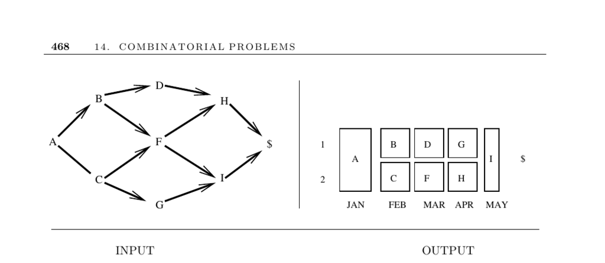

- **14.9 Job Scheduling**
  - **Input description**
    - The input is a directed acyclic graph (DAG) where vertices represent jobs and edges represent precedence constraints.
    - Edges imply that one task must be completed before another can begin.
  - **Problem description**
    - The goal is to find a schedule minimizing total completion time or processor usage.
    - Scheduling must respect job precedence and duration.
  - **Discussion**
    - Proper scheduling prevents idle resources and bottlenecks in parallel processing.
    - Job scheduling connects to other problems like topological sorting, bipartite matching, coloring, and routing.
    - Precedence constraints must be acyclic to avoid deadlocks.
  - **Key scheduling problems**
    - Critical path analysis identifies the longest path to completion, defining minimal total time.
    - Minimum completion time is determined by maximizing parallel execution under precedence constraints.
    - Balancing number of workers versus completion time is NP-complete.
  - **Approaches and considerations**
    - Ignoring or relaxing constraints can simplify problem solving.
    - Linear-integer programming can model complex constraints.
    - Preemptive scheduling and machine flexibility ease problem difficulty.
  - **Job-shop scheduling**
    - Assigns jobs without precedence to identical machines to minimize total elapsed time.
    - Can be modeled as a bin-packing problem.
    - Sophisticated heuristics exist based on task size and deadlines.
  - **Implementations**
    - JOBSHOP: a C program suite for job-shop scheduling ([Applegate and Cook](http://www2.isye.gatech.edu/~wcook/jobshop/)).
    - Tablix: open source timetabling software with parallel support ([tablix.org](http://tablix.org)).
    - LEKIN: flexible job-shop scheduling system for education ([stern.nyu.edu](http://www.stern.nyu.edu/om/software/lekin)).
    - ILOG CP: state-of-the-art commercial scheduling software ([ilog.com](http://www.ilog.com/products/cp/)).
    - Algorithm 520: Fortran network scheduling code available from Netlib.
  - **Notes**
    - Scheduling literature is vast and well-surveyed in [Brucker 2007](https://www.springer.com/gp/book/9783540239539) and [Pinedo 2002](https://www.springer.com/gp/book/9780387950203).
    - The α|β|γ taxonomy classifies job-shop scheduling problem variants.
    - Gantt charts visualize scheduling with time on x-axis and machines on rows.
    - Precedence scheduling techniques are known as PERT/CPM.
    - Timetabling issues are addressed in the PATAT conference proceedings ([PATAT](http://www.asap.cs.nott.ac.uk/patat/patat-index.shtml)).
