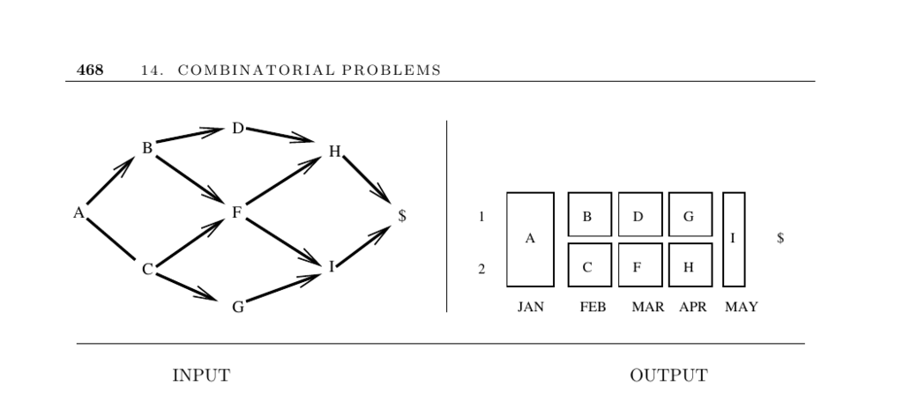

- **Job Scheduling**
  - **Input description**
    - The input is a directed acyclic graph (DAG) where vertices represent jobs and edges represent precedence constraints.
    - An edge (u, v) indicates task u must be completed before task v.
  - **Problem description**
    - The problem is to schedule tasks to minimize total completion time or processor usage, respecting precedence constraints.
    - Scheduling efficiently prevents bottlenecks where some machines idle while a key task is performed.
  - **Discussion**
    - Scheduling problems vary widely based on constraints and desired schedules.
    - Related problems include topological sorting, bipartite matching, vertex and edge coloring, traveling salesman, and Eulerian cycle.
    - These related problems assist in constructing precedence-consistent schedules, assigning jobs to skilled people, and optimizing timing and routes.
  - **Precedence-constrained scheduling for DAGs**
    - Tasks are broken into smaller subtasks with known durations and dependencies forming a DAG.
    - Cycles in precedence constraints represent unsolvable deadlocks.
    - Key problems include:
      - Critical path: longest path determining minimum completion time, computable in O(n+m).
      - Minimum completion time: fastest finish with unlimited workers, defined by critical path length.
      - Tradeoff between workers and time: generally NP-complete to optimize.
  - **Approaches to complex scheduling constraints**
    - One method ignores difficult constraints until simpler problems are solved, then adjusts manually.
    - Another uses linear-integer programming for full problem complexity.
    - Simple initial solutions are recommended before complexity is added.
  - **Job-shop scheduling without precedence constraints**
    - Assign jobs to identical machines to minimize elapsed time, modeled as bin packing.
    - More complex variants add allowable start and finish times.
    - Effective heuristics exist based on sorting by size and finish time.
    - Preempting and splitting tasks across machines simplifies problem complexity.
  - **Implementations**
    - JOBSHOP: C programs for job-shop scheduling from Applegate and Cook [AC91].
    - Tablix: open-source timetabling software with parallel/cluster support.
    - LEKIN: flexible job-shop scheduler supporting multiple environments [Pin02].
    - ILOG CP: state-of-the-art commercial scheduling software.
    - Algorithm 520: Fortran code for multiple-resource network scheduling available on Netlib.
  - **Notes**
    - Scheduling literature is extensive; Brucker [Bru07] and Pinedo [Pin02] provide comprehensive overviews.
    - The Handbook of Scheduling [LA04] compiles current surveys on algorithms and theory.
    - The α|β|γ taxonomy classifies job-shop variants by machine environment, constraints, and objectives.
    - Visualizations use Gantt charts and PERT/CPM for precedence-constrained projects.
    - Timetabling refers to classroom and scheduling problems, with biannual PATAT conference documenting advances.
  - **Related problems**
    - Topsort (section 15.2), matching (15.6), vertex coloring (16.7), edge coloring (16.8), bin packing (17.9) provide foundational methods connected to scheduling.
    - For more information see [Handbook of Scheduling](https://www.springer.com/gp/book/9781402032097).
