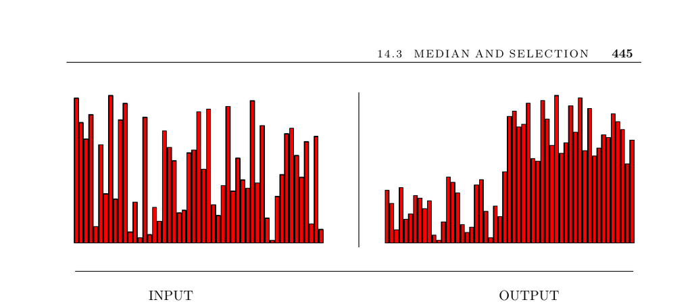

- **Median and Selection**
  - **Input description and problem statement**
    - The input consists of a set of n numbers or keys, and an integer k.  
    - The problem is to find the key smaller than exactly k of the n keys.  
    - Median finding is a special case of selection, focusing on the middle element.  
  - **Applications of selection**
    - Selection helps filter outlying elements by identifying percentile bounds.  
    - It assists in identifying top candidates for further analysis, e.g., in chess programs.  
    - Selection is used to compute deciles and other order statistics.  
    - Special cases include finding the smallest, largest, and median elements.  
  - **Algorithmic complexity and approaches**
    - Sorting and then selecting kth element requires O(n log n) time.  
    - An expected linear-time algorithm uses randomized partitioning similar to quicksort.  
    - Worst-case linear-time algorithms for median and selection also exist but are more complex.  
    - Selecting random pivots helps avoid worst-case quadratic behavior.  
  - **Handling data streams and approximate methods**
    - Exact median finding is expensive when data can only be seen once or is too large for storage.  
    - Random sampling provides approximate quantiles by storing a subset of the data.  
    - Combining decile summaries from blocks improves accuracy for streaming data analysis.  
  - **Finding the mode and complexity limits**
    - The mode is the element appearing most frequently in the data set.  
    - Computing the mode requires sorting (O(n log n)) and a linear pass to find the longest run.  
    - There is an Ω(n log n) lower bound for mode computation due to the element uniqueness problem.  
    - Theoretical improvements exist for datasets where the mode is large, leveraging median computations.  
  - **Implementations and notes**
    - The C++ STL provides a linear expected-time selection method (nth_element).  
    - The expected-time median algorithm was introduced by Hoare (1961).  
    - Further reading on median and selection includes [CLRS01](https://example.org), [Raw92](https://example.org), and streaming algorithms surveyed by [Muthukrishnan05](https://example.org).  
    - Theoretical and combinatorial bounds are given by Dor and Zwick (1999, 2001) and others.  
  - **Related problems**
    - Related concepts include priority queues and sorting algorithms as foundational tools.
