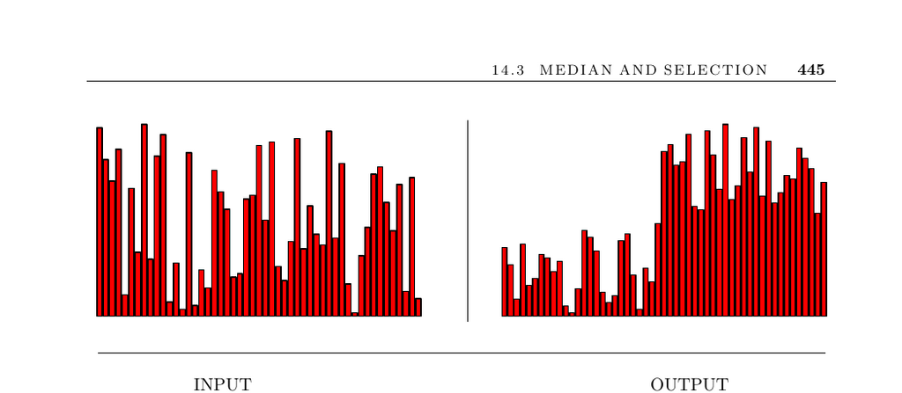

- **Median and Selection**
  - **Input description**
    - The problem takes as input a set of n numbers or keys and an integer k.  
    - The goal is to find the key smaller than exactly k of the n keys.
  - **Problem description and applications**
    - Median finding provides a robust average measure more resilient than the mean.  
    - Selection is a generalization of median finding that locates the kth element in sorted order.  
    - Applications include filtering outliers, identifying promising candidates, deciles computation, and order statistics.  
    - Relevant resource: [CLRS - Introduction to Algorithms](https://mitpress.mit.edu/books/introduction-algorithms-third-edition).
  - **Algorithmic issues and solutions**
    - The simplest median-finding algorithm sorts the dataset in O(n log n) and retrieves the middle element.  
    - The expected linear-time selection algorithm uses randomized pivots and partitions; it delivers average O(n) time but worst-case O(n²).  
    - More complex algorithms guarantee worst-case linear-time selection but are less practical.  
    - External-memory and streaming constraints necessitate approximate or sampling-based selection methods.  
    - Computing the mode requires O(n log n) time due to element uniqueness lower bounds.  
    - Further reading: [Hoare's Quickselect Algorithm](https://dl.acm.org/doi/10.1145/365230.365234).
  - **Implementations and references**
    - The C++ STL provides a general selection method called nth_element using the expected linear-time algorithm.  
    - Advanced theoretical improvements reduce the number of comparisons needed for median finding but do not enhance practical speed.  
    - Streaming algorithms for large datasets provide approximate summaries such as deciles or frequency moments.  
    - Key references include [Josuttis (1999)](http://www.sgi.com/tech/stl/), [Meyers (2001)], [Muthukrishnan (2005)].
