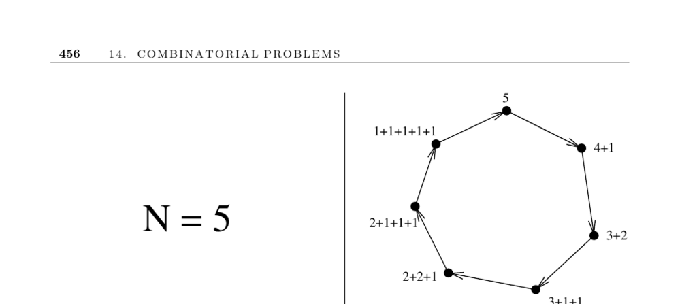

- **14. COMBINATORIAL PROBLEMS**
  - **14.6 Generating Partitions**
    - The term "partition" refers to two distinct combinatorial objects: integer partitions and set partitions.  
    - Integer partitions are multisets of positive integers that sum exactly to n, with applications such as modeling nuclear fission cluster sizes.  
    - Set partitions separate the elements {1,...,n} into nonempty subsets, used in problems like graph coloring and connectivity.  
    - Integer partitions grow exponentially in number with n but remain enumerable for moderately large values; for example, there are 627 partitions of 20 and 190,569,292 of 100.  
    - Generating integer partitions in lexicographically decreasing order involves reducing the smallest part > 1 and redistributing leftover ones.  
    - Uniform random generation of integer partitions requires recurrence relations (Pn,k = Pn-k,k + Pn,k-1) to correctly weight choices of largest parts.  
    - Set partitions can be represented by restricted growth functions, where each value indicates the block membership with a canonical ordering.  
    - Stirling numbers of the second kind count the number of set partitions with exactly k blocks using a specific recurrence relation.  
    - External resources and implementations are available from Kreher and Stinson [KS99], the Combinatorial Object Server, Nijenhuis and Wilf [NW78], and Combinatorica [PS03].
