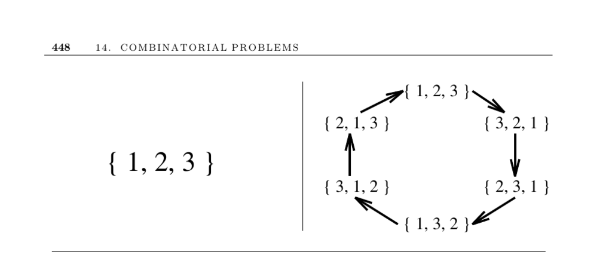

- **14.4 Generating Permutations**
  - **Introduction to Permutations**
    - A permutation is an arrangement or ordering of items with n! total permutations for n items.
    - Generating all permutations becomes impractical for n > 12 due to factorial growth.
    - Applications include traveling salesman, bandwidth minimization, and graph isomorphism.
    - Lexicographic order is the natural sequence for permutations but not always the most efficient.
    - See [Knuth's The Art of Computer Programming](https://www-cs-faculty.stanford.edu/~knuth/taocp.html) for deeper insights.
  - **Rank and Unrank Paradigm**
    - Rank(p) determines the position of a permutation p in the generation order recursively.
    - Unrank(m, n) finds the permutation at position m among n! permutations using recursive division by factorial values.
    - Rank and unrank functions are inverses, ensuring accurate bidirectional conversion.
    - The method supports finding the next or previous permutation by adjusting the rank.
    - Myrvold and Ruskey's work [Myrvold & Ruskey (2001)](https://doi.org/10.1145/502512.502536) describes efficient ranking/unranking.
  - **Incremental Change Methods**
    - Incremental change methods generate permutations via swaps, typically with one swap per step.
    - They are fast, often constant-time on average, and practical for applications requiring only local changes.
    - Johnson-Trotter algorithm ensures swaps of adjacent elements only.
    - Efficient incremental algorithms can be implemented concisely with arrays and swaps.
    - The implementation section refers to [Kreher and Stinson (1999)](http://www.math.mtu.edu/~kreher/cages/Src.html) for C code.
  - **Handling Duplicates and Multisets**
    - Permutations of multisets have fewer distinct permutations due to duplicates.
    - Backtracking in lexicographic order avoids generating duplicate permutations.
    - Example: {1,1,2,2,2} has 10 distinct permutations instead of 120.
    - Combinatorica provides backtracking routines to handle multiset permutations.
    - See [Combinatorica Mathematica Package](https://www.wolfram.com/combinatorica/) for implementations.
  - **Generating Random Permutations**
    - The correct random permutation algorithm involves swapping each element with a randomly selected element in or after its position.
    - Incorrect algorithms, such as swapping with a random element from the entire array each time, do not generate permutations uniformly.
    - Testing the random generator statistically (e.g., generating 10,000 permutations of length 4) ensures uniform distribution.
    - The original swap-based algorithm was described in [Menezes and Oommen (1963)].
    - Section 12.5 discusses setting bit vectors for tracking seen permutations.
  - **Implementations and Resources**
    - The C++ STL provides next_permutation and prev_permutation functions for lexicographic sequencing.
    - Resources include Kreher and Stinson's C implementations, Frank Ruskey's Combinatorial Object Server, and Nijenhuis and Wilf's Fortran algorithms.
    - Mathematica's Combinatorica offers extensive combinatorial algorithms, including permutation generation.
    - Good surveys include Sedgewick (1977) and Knuth (2005).
    - Access the Combinatorial Object Server at [theory.cs.uvic.ca](http://theory.cs.uvic.ca/)
    - For C++ routines, see [jjj.de/fxt](http://www.jjj.de/fxt/).
