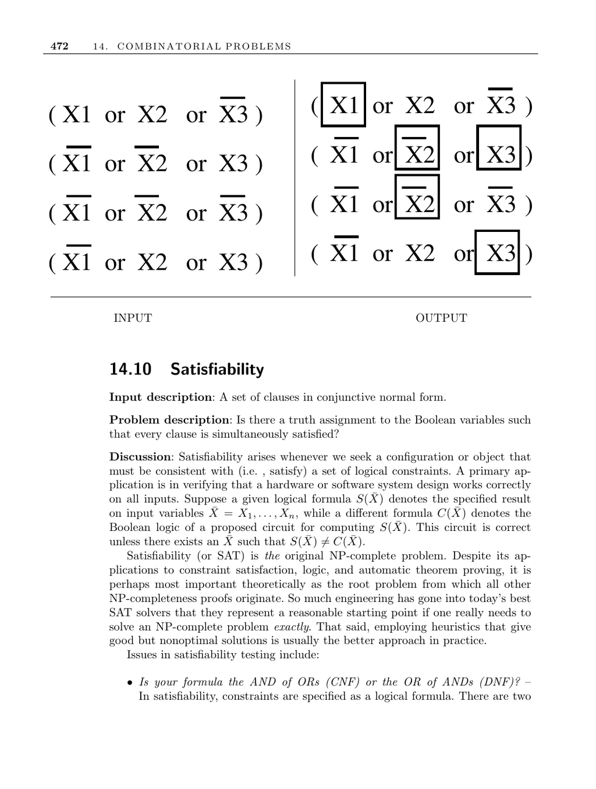

- **14.10 Satisfiability**
  - **Input Description and Problem Statement**
    - The input is a set of clauses expressed in conjunctive normal form (CNF).
    - The problem asks if there exists a truth assignment to Boolean variables that simultaneously satisfies all clauses.
    - Satisfiability tests logical consistency of configurations or objects under given constraints.
    - Applications include verifying hardware and software system correctness.
  - **Formula Representations and Complexity**
    - CNF formulas require all clauses to be satisfied; each clause is an OR of literals.
    - Disjunctive normal form (DNF) requires satisfying any one clause; each clause is an AND of literals.
    - DNF satisfiability is trivial unless clauses contain both a literal and its negation.
    - CNF satisfiability is NP-complete, complicated by potential exponential growth when converting between CNF and DNF.
  - **Clause Size and Problem Variants**
    - k-SAT variant restricts clauses to at most k literals each.
    - 1-SAT is trivial; variables can be assigned directly.
    - 2-SAT is solvable in linear time and models some problems cleverly.
    - 3-SAT and beyond are NP-complete and represent a complexity threshold.
  - **Exact vs. Approximate Solutions**
    - Exact satisfiability solutions use backtracking algorithms such as Davis-Putnam.
    - Worst-case testing involves 2^m truth assignments, where pruning strategies are essential.
    - Real-world “random” instances are often easier than worst-case scenarios.
    - Relaxed optimization seeks assignments satisfying most clauses, an NP-complete maximization problem.
    - Random assignments satisfy k-SAT clauses with probability 1 - (1/2)^k, facilitating heuristic approaches.
  - **Hardness Proofs and Practical Approaches**
    - Proving NP-completeness is crucial when problem complexity is unknown.
    - Starting proofs from basic NP-complete problems like 3-SAT and vertex cover is recommended.
    - Modern SAT solvers significantly improve practical problem solving.
    - Top SAT solvers (2007 industrial competition): Rsat, PicoSAT, MiniSAT.
    - The [SAT Competition webpage](http://www.satcompetition.org/) and [SAT Live!](http://www.satlive.org/) provide resources.
  - **Historical and Theoretical Context**
    - Davis-Putnam-Logemann-Loveland (DPLL) algorithm is a foundational backtracking approach.
    - Local search techniques complement DPLL for certain problem classes.
    - Chaff is a significant SAT solver introduced in 2001.
    - Worst-case 3-SAT solving algorithms operate in O*(1.4802^n) time.
    - Primary references include [Garey and Johnson 1979](https://www.springer.com/gp/book/9780387900446), [Cook 1971], and surveys by [Kautz et al. 2007](https://mitpress.mit.edu/books/satisfiability-handbook).
  - **Related Areas**
    - Related combinatorial and optimization problems include constrained optimization and traveling salesman problem.
