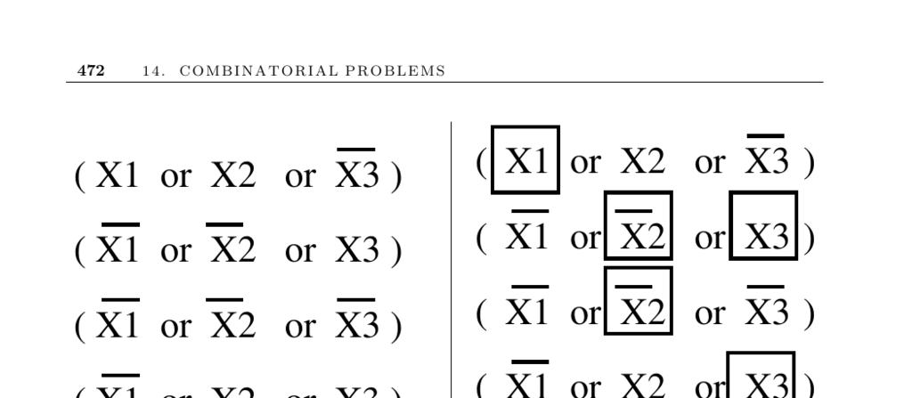

- **14.10 Satisfiability**
  - **Input description**
    - The input is a set of clauses in conjunctive normal form (CNF).
  - **Problem description**
    - The problem asks if a truth assignment exists to Boolean variables such that all clauses are simultaneously satisfied.
  - **Discussion**
    - Satisfiability tests if a logical formula meets all constraints, important for verification of hardware and software correctness.
    - SAT is the root NP-complete problem and foundational for many NP-completeness proofs.
    - Practical SAT solving often uses heuristics for near-optimal solutions due to the problem’s complexity.
  - **Issues in satisfiability testing**
    - CNF formulas require all clauses (ORs of literals) to be satisfied, while DNF formulas require any clause (ANDs of literals) to be satisfied.
    - DNF satisfiability is trivial except when clauses contain both a literal and its negation; CNF satisfiability is NP-complete.
    - The translation between CNF and DNF can cause exponential growth in formula size.
    - k-SAT problems limit clause size; 1-SAT is trivial, 2-SAT solvable in linear time, and 3-SAT is NP-complete.
    - Exact solutions rely on backtracking algorithms like Davis-Putnam; average-case hardness varies by instance generation method.
    - Relaxed versions aim to satisfy the maximum number of clauses, which remains NP-complete even for unsatisfiable instances.
  - **Proving NP-completeness and solving approaches**
    - NP-completeness proofs can start from basic problems such as 3-SAT, vertex cover, clique, and Hamiltonian cycle.
    - Recent years have seen significant advances in SAT solvers with competitions highlighting top-performing solvers.
  - **Implementations and resources**
    - Notable solvers include Rsat, PicoSAT, and MiniSAT, with source code available online.
    - SAT Live! provides updated papers, programs, and test sets for satisfiability research.
    - The DPLL algorithm is a foundational backtracking method; local search like Chaff is effective on some difficult problems.
    - Surveys and literature include [KSBD07], [MMZ+01], [KS07], and [GJ79], which also catalog about 400 NP-complete problems.
    - Efficient nonpolynomial algorithms for NP-complete problems are reviewed in [Woe03].
    - Linear-time 2-SAT algorithms exist and applications extend to areas like map labeling.
  - **Related problems**
    - Satisfiability relates to constrained optimization and the traveling salesman problem.
  - **Further reading**
    - [SAT Competition](http://www.satcompetition.org/)
    - [SAT Live!](http://www.satlive.org/)
    - Garey and Johnson, *Computers and Intractability* [GJ79]
    - Kautz et al., overview of satisfiability testing [KSBD07]
    - Original NP-completeness proofs by Cook [Coo71] and Karp [Kar72]
