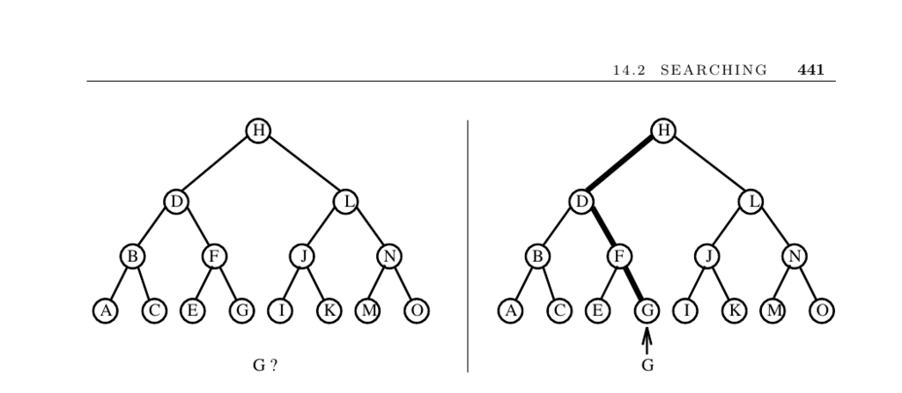

- **14.2 Searching**
  - **Input and Problem Description**
    - The input consists of a set of n keys S and a query key q to locate in S.  
    - Searching involves finding whether q is in S.
    - Different interpretations of searching include optimization and exhaustive search in game playing.
  - **Basic Searching Approaches**
    - Sequential search compares keys one-by-one from the front until a match or the end is reached.
    - Binary search operates on sorted arrays by repeatedly partitioning the search space in half.
    - Binary search requires about ⌈lg n⌉ comparisons, outperforming sequential search on large sets.
  - **Algorithmic Considerations**
    - Programming difficulty: Binary search is complex and requires careful implementation and testing.
    - Access frequency skew: Popular keys can be placed earlier in sequential search to reduce comparisons.
    - Optimal binary search trees minimize expected search cost via dynamic programming based on access frequencies.
    - Self-organizing lists adapt dynamically by moving recently accessed keys to the front.
    - Self-organizing structures can exploit locality of reference and extend sequential search viability.
    - Splay trees provide self-organizing binary search trees with good amortized performance.
  - **Specialized Searching Scenarios**
    - Searching near a known position p can use one-sided binary search for faster discovery.
    - External memory constraints favor data structures like B-trees and Van Emde Boas trees over binary search.
    - Interpolation search exploits knowledge of key distribution to guess positions, but has practical and robustness limitations.
  - **Implementations and Resources**
    - Basic sequential and binary search algorithms are straightforward to implement.
    - C standard library has bsearch; C++ STL provides find and binary_search iterators.
    - Java Collections framework offers a java.util.binarySearch method.
    - Recommended further reading includes Sedgewick and Weiss implementations of search structures.
    - The Handbook of Data Structures and Applications offers comprehensive surveys on dictionary data structures.
