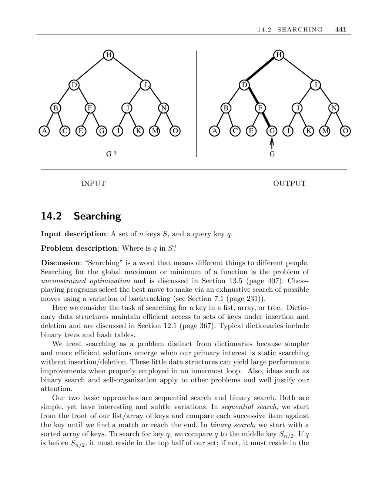

- **14.2 Searching**
  - **Input and problem description**
    - The input consists of a set of n keys S and a query key q.  
    - The problem is to locate q within S.  
    - Searching can have different interpretations depending on context, including optimization and backtracking.  
  - **Basic approaches to searching**
    - Sequential search scans from the start, comparing each key until a match or end is reached.  
    - Binary search requires a sorted array and repeatedly halves the search interval, achieving O(lg n) comparisons.  
    - Sequential search performs well up to about 20 elements; beyond 100, binary search is more efficient.  
  - **Key considerations for choosing a search algorithm**
    - Programming effort: binary search is challenging to implement correctly; testing against every key and gaps is advised.  
    - Access frequency: arranging keys by popularity improves sequential search; optimal binary search trees minimize expected cost using dynamic programming.  
    - Changing access patterns: self-organizing lists using move-to-front adapt order dynamically without prior knowledge.  
    - Proximity knowledge: one-sided binary search helps when the key is near a known position and improves performance over ordinary binary search.  
    - External memory constraints: binary search performance degrades with large data on external storage; B-trees and Emde Boas trees reduce disk access.  
    - Guessing key position: interpolation search uses key distribution to predict next probe position but is complex, sensitive to distribution changes, and less robust than binary search.  
  - **Implementations and resources**
    - Standard libraries implement binary search: C's bsearch, C++ STL's find and binary_search, and Java's binarySearch.  
    - Sedgewick and Weiss provide implementations of splay trees and other data structures in C++ and Java.  
    - The Handbook of Data Structures and Applications offers comprehensive surveys on dictionary data structures.  
  - **Notes and advanced concepts**
    - Interpolation search mathematically estimates the next index and achieves O(lg lg n) expected time under uniform distribution.  
    - Dynamic programming constructs optimal binary search trees in O(n lg n) time to reduce expected search cost.  
    - Stout and Warren's algorithm transforms binary trees to optimally balanced trees using rotations.  
    - The Van Emde Boas layout improves external memory performance over conventional binary search at the cost of complexity.  
    - See Arge et al. for surveys on cache-oblivious data structures and external memory performance.  
  - **Related problems**
    - Searching relates closely to dictionaries (efficient data access structures) and sorting algorithms.
