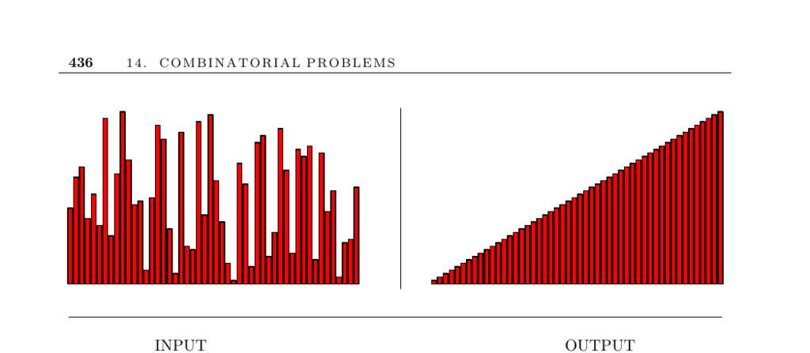

- **14.1 Sorting**
  - **Problem description**
    - Sorting arranges a set of n items in increasing or decreasing order.
    - Sorting is fundamental in computer science and serves as a first step in solving many algorithmic problems.
    - Sorting algorithms exhibit all major algorithm design paradigms.
  - **Sorting criteria**
    - The choice of algorithm depends on the number of items, stability needs, data properties, and external memory considerations.
    - Stable sorting preserves original ordering among items with equal keys; instability arises mainly in O(n lg n) algorithms.
    - Use quadratic-time algorithms like insertion sort for small n (≤100), and O(n lg n) algorithms like quicksort or mergesort for larger n.
  - **Data-specific strategies**
    - Partial presortedness favors insertion sort.
    - Uniform key distribution suits bucket or distribution sort; skewed distribution may degrade performance.
    - Long or complex keys benefit from prefix sorting or radix sort for time efficiency.
    - Small key ranges enable bit vector sorting for linear-time performance.
  - **External sorting**
    - Large datasets exceeding memory call for external sorting techniques like multiway mergesort.
    - B-trees and advanced merging patterns optimize disk access.
    - Virtual memory swapping impacts performance negatively for most internal sorting algorithms.
  - **Implementation and heuristics**
    - For rapid development, selection sort is simplest; heapsort offers reliable performance with minimal tuning.
    - Quicksort is the general-purpose choice but requires heuristics such as randomization, median-of-three pivots, insertion sort cutoff on small subarrays, and processing smaller partitions first.
    - Using library sorting functions is recommended over self-implementation.
  - **Resources and implementations**
    - Refer to GNU sort for a freely available, high-quality implementation.
    - C standard library offers qsort; C++ STL provides sort and stable_sort methods.
    - Java Collections include SortedMap and SortedSet classes for sorting.
    - Cache-oblivious algorithms like funnelsort have competitive performance.
    - Sorting algorithm animations can be found at sites like Harrison's and Bentley's.
    - The seminal reference book is Knuth [Knu98], and further algorithmic guides include Josuttis [Jos99], Meyers [Mey01], and Musser [MDS01].
  - **Historical and theoretical notes**
    - Heapsort was invented by Williams; quicksort by Hoare; mergesort's first implementation credited to Von Neumann.
    - Sorting has a well-known Ω(n lg n) lower bound under the algebraic decision tree model.
    - Advances include sorting under presortedness measures and alternative computation models permitting faster sorting.
    - Annual high-performance sorting competitions reveal progress and system-level challenges.
    - Modern engineering includes cache-conscious and cache-oblivious sorting improvements.
  - **Related problems**
    - Sorting relates closely to dictionaries, searching, and topological sorting.
    - See further related problems on pages 367, 441, and 481.
  - **Further reading**
    - [GNU Coreutils - sort](http://www.gnu.org/software/coreutils/)
    - [STL documentation](http://www.sgi.com/tech/stl/)
    - [Sorting algorithm animations by Bentley](http://www.cs.bell-labs.com/cm/cs/pearls/sortanim.html)
    - [Knuth, The Art of Computer Programming, Volume 3: Sorting and Searching](https://www-cs-faculty.stanford.edu/~knuth/taocp.html)
    - [Sort Benchmark](http://research.microsoft.com/barc/SortBenchmark/)
