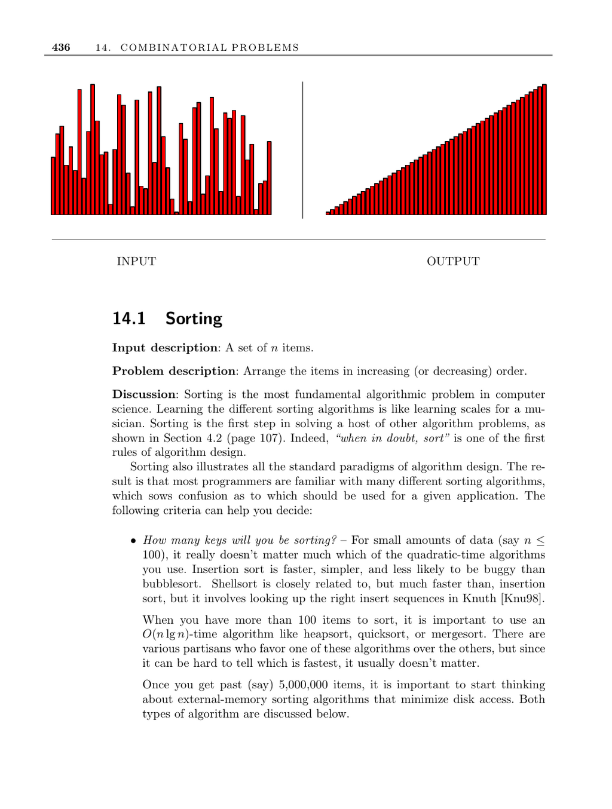

- **14.1 Sorting**
  - The problem is to arrange a set of n items in increasing or decreasing order.
  - Sorting is fundamental for algorithm design and is often the first step in solving many other problems.
  - Choosing a sorting algorithm depends on data size, presence of duplicate keys, special knowledge about data, disk access considerations, and time available for implementation.
  - Stable sorting preserves the original order of equal keys and is important in some applications.
  - For large datasets (over 100 items), O(n log n) algorithms like heapsort, quicksort, or mergesort are preferred.
  - External sorting handles datasets too large for memory using multiway merges and optimized buffer management.
  - Quicksort is the best general-purpose internal sorting algorithm but requires tuning; heuristics include randomization, median-of-three pivot selection, and switching to insertion sort for small subarrays.
  - Libraries such as GNU sort, C qsort, C++ STL sort/stable_sort, and Java Collections offer efficient sorting implementations.
  - Additional concepts include cache-conscious and cache-oblivious sorting, and algorithms optimized for presorted or special key distributions.
  - Refer to Knuth [Knu98] for comprehensive coverage of sorting, Bentley’s article [Ben92b] for quicksort optimization, and [GBY91] for sorting with partial order.
  - The annual Jim Gray Sort Benchmark tracks high-performance sorting developments; see [Sort Benchmark](http://research.microsoft.com/barc/SortBenchmark/).
