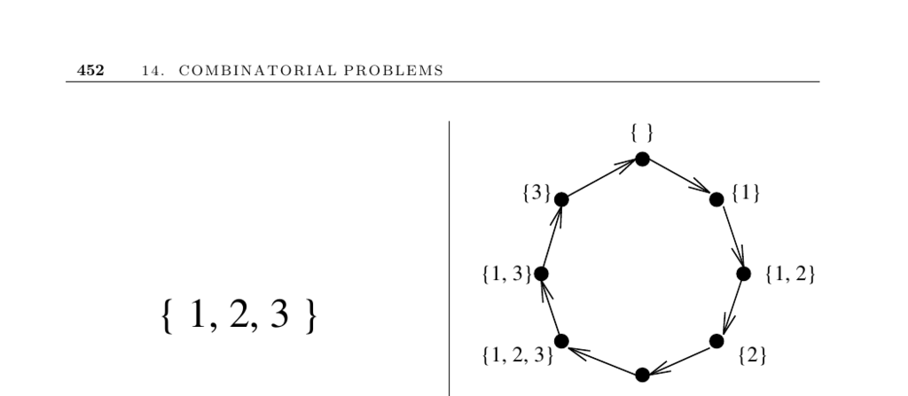

- **14.5 Generating Subsets**
  - **Input description and problem definition**
    - The input is an integer n representing the set {1, ..., n}.  
    - The problem requires generating all, a random, or the next subset of this set.  
    - Subsets are defined as selections where order does not matter and duplicates are not distinguished.

  - **General properties of subsets**
    - There are 2^n distinct subsets of an n-element set, including the empty set and the full set.  
    - The number of subsets grows exponentially but slower than the n! permutations.  
    - Maintaining subsets in sorted or canonical order increases efficiency when comparing subsets.

  - **Primary subset generation orders**
    - **Lexicographic order**
      - Orders subsets as sorted sequences and is natural but difficult to generate.  
      - Example subsets of {1,2,3} in lex order: {}, {1}, {1,2}, {1,2,3}, {1,3}, {2}, {2,3}, {3}.  
      - Generally not recommended to use unless specifically required.
    - **Gray Code order**
      - Generates subsets so that adjacent subsets differ by only one element (minimum change).  
      - Constructed recursively by combining Gray codes of n-1 elements and their reverse with element n added.  
      - Efficient for exhaustive search algorithms because only one element changes at a time.  
      - Useful in scenarios like set cover to efficiently update coverage changes.  
      - Further insights can be found in the implementations section.
    - **Binary counting order**
      - Represents subsets as binary strings where bit i indicates inclusion of element i.  
      - Generates all subsets by counting from 0 to 2^n - 1 and masking bits to form subsets.  
      - Simplifies generating next, previous, and random subsets.  
      - Random subsets can be generated by coin flips for each element or generating random numbers.  
      - This approach is the foundational method for subset generation problems.

  - **Related subset generation problems**
    - **K-subsets (combinations)**
      - Focuses on subsets of size exactly k, reducing the number from 2^n to n choose k.  
      - Best generated in lexicographic order using a ranking function based on the smallest element.  
      - Recursive methods identify each element for the mth combination effectively.  
      - Implementations and more details are provided later in the document.
    - **Strings generation**
      - Generating subsets is equivalent to generating all 2^n boolean strings.  
      - Similar techniques apply to create strings from larger alphabets with α^n total strings.

  - **Implementations and resources**
    - Kreher and Stinson [KS99] provide C implementations for subsets and k-subsets generation including lexicographic and Gray code orders ([Source](http://www.math.mtu.edu/~kreher/cages/Src.html)).  
    - The Combinatorial Object Server by Frank Ruskey offers an interactive interface and implementations in C, Pascal, and Java ([Server](http://theory.cs.uvic.ca/)).  
    - C++ routines for various combinatorial objects including subsets are available at [jjj.de](http://www.jjj.de/fxt/).  
    - Nijenhuis and Wilf [NW78] deliver efficient Fortran implementations for random subset generation and sequencing subsets; also provide k-subset methods.  
    - Algorithm 515 [BL77] in ACM's Collected Algorithms is a Fortran implementation for lexicographic k-subsets at Netlib.  
    - Combinatorica [PS03] offers Mathematica algorithms for subsets, k-subsets, and strings in multiple orders.  
    - For best reference and comprehensive understanding, see Knuth [Knu05b], with supporting work from [KS99, NW78, Rus03], and Wilf [Wil89].

  - **Gray code background and applications**
    - Gray codes originated for robust digital signal transmission to minimize errors.  
    - In Gray code sequences, each codeword differs from its successor by one bit, related to Hamiltonian cycles on hypercubes.  
    - Savage [Sav97] surveys Gray codes for many combinatorial objects, including subsets.  
    - The puzzle Spinout uses Gray code concepts for its solution mechanics.

  - **Related problems**
    - Subset generation is related to permutation and partition generation problems with methods outlined on pages 448 and 456 respectively.
