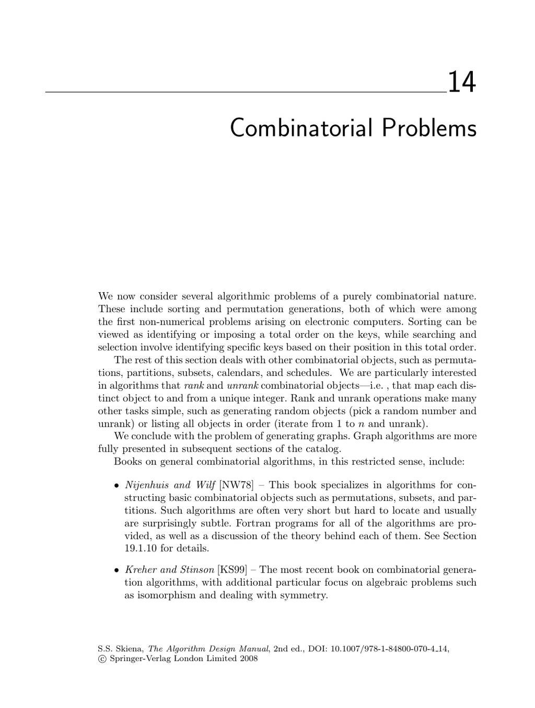

- **14.1 Sorting**
  - Sorting arranges a set of n items in increasing or decreasing order.
  - Key criteria for choosing sorting algorithms include data size, presence of duplicate keys, and knowledge about data distribution.
  - Sorting paradigms include internal sorting algorithms (quicksort, heapsort, mergesort) and external sorting for massive datasets.
  - Stable sorting maintains the original order of equal keys, and specialized algorithms exist for partially sorted inputs or limited key ranges.
  - Refer to [Knuth's Sorting](https://doi.org/10.5555/58090) for the standard reference and [Bentley's faster quicksort](http://www.cs.bell-labs.com/cm/cs/pearls/sortanim.html).

- **14.2 Searching**
  - Searching finds a query key in a set of n keys, typically via sequential or binary search.
  - Binary search requires sorted data and executes in O(log n) time, but programming it correctly is challenging.
  - Access frequency distributions (Zipf's law) influence search strategy and data structure design.
  - Self-organizing lists and splay trees adapt to changing access frequencies.
  - For external memory, B-trees and Van Emde Boas layouts optimize disk access.
  - See [Knuth's Search Algorithms](https://doi.org/10.5555/58090) and [The Handbook of Data Structures and Applications](https://www.crcpress.com/The-Handbook-of-Data-Structures-and-Applications/Gonnet/p/book/9781420051790).

- **14.3 Median and Selection**
  - Median finding determines the element smaller than exactly k others, a special case of the selection problem.
  - Linear-time expected algorithms like that of Hoare exist, while worst-case linear-time algorithms are more complex.
  - Streaming data applications require approximate medians using sampling or summaries.
  - Computing the mode requires sorting and is Ω(n log n) in the worst case.
  - Consult [Hoare's Selection Algorithm](https://doi.org/10.1093/comjnl/4.3.226) and [Muthukrishnan's Streaming Algorithms](https://doi.org/10.1145/1190255.1190284).

- **14.4 Generating Permutations**
  - Permutations arrange n distinct items; there are n! permutations in total.
  - Algorithms employ ranking/unranking (mapping permutations to integers) or incremental change methods (single swaps).
  - Ranking functions are recursive, while incremental methods optimize generation speed, often constant time per permutation.
  - Special care is needed to handle multisets to avoid duplicates.
  - The Fisher-Yates shuffle provides uniform random permutation generation.
  - See [Knuth on Permutations](https://doi.org/10.1145/1283383.1283444) and [Nijenhuis and Wilf's Combinatorial Algorithms](https://www.amazon.com/Combinatorial-Algorithms-Repertoire-Eldad-Nijenhuis/dp/0125192602).

- **14.5 Generating Subsets**
  - Subsets select elements from {1,...,n}; there are 2^n subsets including the empty set.
  - Key enumeration orders include lexicographic, Gray code (minimum change), and binary counting.
  - Gray code subsets differ by exactly one element between successive subsets, facilitating efficient updates.
  - k-subsets (fixed-size subsets) can be generated lexicographically using combinatorial number systems.
  - See [Wilf's Combinatorial Algorithms](https://www.amazon.com/Generatingfunctionology-Herbert-Wilf/dp/0127999535) and [Kreher and Stinson's Combinatorial Algorithms](http://www.math.mtu.edu/~kreher/cages/).

- **14.6 Generating Partitions**
  - Integer partitions are multisets of positive integers summing to n; set partitions divide {1,...,n} into blocks.
  - Integer partitions are most often generated in lexicographically decreasing order.
  - Random integer partitions can be generated using the recurrence for the number of partitions with largest part ≤ k.
  - Set partitions correspond bijectively to restricted growth functions, with counts given by Stirling numbers of the second kind.
  - See [Knuth's The Art of Computer Programming, Volume 4](https://doi.org/10.5555/58090) and [Andrews on Integer Partitions](https://doi.org/10.1017/CBO9780511609837).

- **14.7 Generating Graphs**
  - Graph generation can be labeled/unlabeled, directed/undirected, and random or structured.
  - Random graph models include edge probability p, fixed edge number m, and preferential attachment.
  - Labeled graphs are simpler to generate; unlabeled graphs remove isomorphic duplicates.
  - Labeled trees correspond bijectively to Prüfer sequences, enabling ranking/unranking.
  - Generating graphs with a fixed degree sequence uses recursive constructions and edge-flipping operations.
  - Refer to [The Stanford GraphBase](https://www-cs-faculty.stanford.edu/~knuth/sgb.html) and [McKay's Nauty](http://cs.anu.edu.au/~bdm/nauty/).

- **14.8 Calendrical Calculations**
  - Calendrical calculations map calendar dates to day of the week and handle multiple calendar systems.
  - Calendar systems differ by epoch, wrapping rules, leap day handling, and complexity (Gregorian, Julian, Hebrew, Islamic, Mayan).
  - Implementations rely on ranking/unranking days relative to an epoch.
  - Comprehensive implementations include Dershowitz and Reingold's Calendrical algorithms.
  - Refer to [Calendrical Calculations](http://calendarists.com) and the Boost Date_Time C++ library.

- **14.9 Job Scheduling**
  - Job scheduling solves precedence-constrained task orderings represented by DAGs.
  - Critical path identifies the longest path and minimum completion time assuming unlimited processors.
  - Trade-offs between processors and completion time lead to NP-complete problems.
  - Related scheduling problems include topological sort, bipartite matching, vertex and edge coloring, traveling salesman, and Eulerian cycle.
  - Practical methods include heuristics and integer linear programming.
  - See [Applegate and Cook's JOBSHOP](http://www2.isye.gatech.edu/~wcook/jobshop/) and [Brucker's Scheduling](https://www.springer.com/gp/book/9783540273586).

- **14.10 Satisfiability**
  - Satisfiability (SAT) asks whether Boolean variables can satisfy all clauses in conjunctive normal form (CNF).
  - CNF-SAT is NP-complete; 2-SAT is solvable in linear time; DNF satisfiability is trivial.
  - Random or heuristic methods can approximate solutions when exact solutions are infeasible.
  - State-of-the-art SAT solvers include Rsat, PicoSAT, and MiniSAT.
  - Key references include [Garey and Johnson's Computers and Intractability](https://doi.org/10.5555/58090) and [KSBD07 SAT Survey](https://doi.org/10.1016/j.jcss.2007.01.011).
