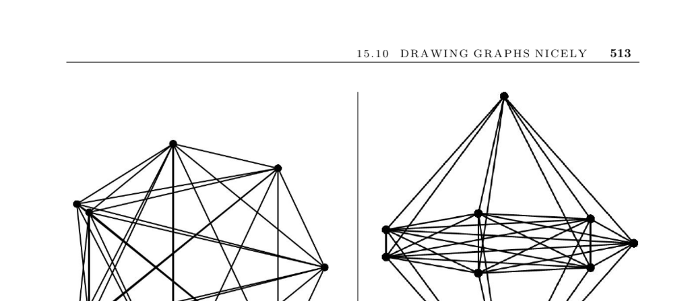

- **Drawing Graphs Nicely**
  - **Input and Problem Description**
    - The input is a graph \( G \).
    - The problem is to draw \( G \) to accurately reflect its structure and to be aesthetically pleasing.
    - The criteria for a nice drawing are inherently ill-defined and context-dependent.
  - **Criteria for Good Graph Drawings**
    - Minimize edge crossings as they distract the viewer.
    - Reduce area usage while maintaining adequate vertex spacing.
    - Avoid long edges to prevent obscuring features.
    - Maximize angular resolution by avoiding small angles between incident edges.
    - Match aspect ratio to the desired output medium, typically 4/3 for screens.
    - Achieving all criteria simultaneously is likely NP-complete.
  - **Practical Challenges and Limitations**
    - Large and dense graphs often overwhelm visual displays, producing indistinguishable "black blobs."
    - Symmetry and structure in the graph aid in producing more attractive drawings.
    - Graph drawing with more than 10 to 15 vertices can lack a nice layout without inherent structure.
  - **Guidelines for Choosing a Drawing Algorithm**
    - Decide if edges must be straight or can have curves/bends.
    - Use application-specific natural drawings when available.
    - Apply planar or tree drawing algorithms for planar graphs or trees.
    - Consider edge direction for directed graphs, especially DAGs.
    - Balance speed needs between interactive updates and batch optimization.
    - Exploit graph symmetries via automorphisms to enhance drawings.
  - **Basic Drawing Techniques**
    - Circular placement of vertices spaced evenly on a circle with straight edges is simple and effective.
    - Simulated annealing can optimize circular drawings by minimizing crossings or edge length.
  - **Spring Embedding Heuristic**
    - Models the graph as a spring system with attractive forces between adjacent vertices and repulsive forces between nonadjacent vertices.
    - Uses iterative energy minimization to achieve stable, visually meaningful layouts.
  - **Polyline Drawings and Labeling**
    - Orthogonal polyline drawings use only horizontal and vertical lines, suitable for complex graphs.
    - Label placement is an NP-complete problem but heuristics based on bin packing can be applied.
  - **Software and Implementations**
    - GraphViz is a popular graph drawing tool using spline edges and supports large graphs.
    - Boost Graph Library interfaces with GraphViz; JGraphT is suitable for interactive Java applications.
    - Commercial solutions include Tom Sawyer Software, yFiles, iLOG’s JViews, and Pajek for social networks.
    - Combinatorica provides Mathematica implementations of several graph drawing algorithms.
  - **Research and Further Reading**
    - An active research community exists with an annual graph drawing conference documented in Springer's Lecture Notes in Computer Science.
    - Recommended books include Battista et al. [BETT99], Kaufmann and Wagner [KW01], and Jünger and Mutzel [JM03].
    - Map-labeling heuristics are covered in [BDY06, WW95].
    - Extensive tables of spherical codes for vertex placement exist [HSS07].
    - See also related problems of drawing trees and planarity testing.
