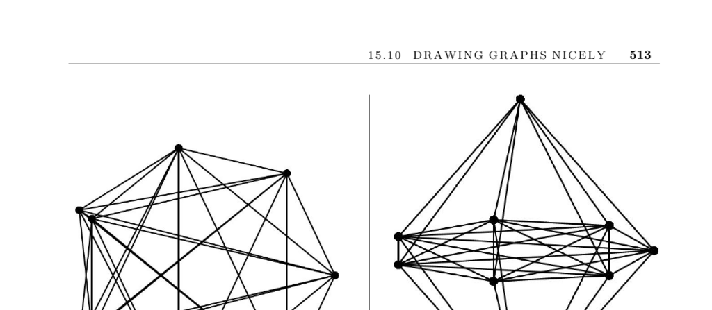

- **Drawing Graphs Nicely**
  - **Input and Problem Description**
    - The input is a graph G to be drawn so as to reflect its structure accurately.
    - The goal is to produce a drawing that shows the graph's structure clearly and looks aesthetically pleasing.
    - The problem is ill-defined due to the subjective notion of what makes a drawing “nice.”
  - **Quality Criteria for Graph Drawings**
    - Minimizing edge crossings reduces distracting overlaps.
    - Using minimal area keeps the drawing compact while spacing vertices adequately.
    - Avoiding long edges preserves clarity by preventing obscuring features.
    - Maintaining good angular resolution avoids small angles between incident edges.
    - The aspect ratio should match the intended display medium, typically 4:3 for screens.
    - Achieving all these criteria simultaneously is generally NP-complete due to conflicts between goals.
  - **Challenges and Practical Limitations**
    - Graphs without inherent symmetries or structure often lack nice drawings.
    - Large, dense graphs produce cluttered drawings, e.g., K100 with about 5,000 edges forms a black blob on common displays.
    - Algorithm speed is critical for interactive applications, favoring incremental local updates.
    - Symmetries in the graph can be exploited by computing automorphisms to enhance drawing quality.
  - **Design Considerations and Questions**
    - Deciding if edges must be straight or can have curves/bends affects algorithm choice.
    - Application-specific layouts (e.g., mapping city graphs to real coordinates) yield better drawings.
    - Special algorithms exist for planar graphs and trees (Sections 15.11 and 15.12).
    - Directed graph drawings benefit from edge directions being visually consistent.
    - Algorithm speed requirements influence the choice between incremental and global methods.
  - **Basic Drawing Techniques**
    - Evenly spacing vertices on a circle and drawing straight edges is a simple and effective starting point.
    - Such circular drawings avoid edge overlap caused by collinear vertices.
    - Simulated annealing can minimize crossings or edge lengths via vertex order permutations.
  - **Spring Embedding Heuristics**
    - Graphs can be modeled as a system of springs, with adjacent vertices attracting and nonadjacent vertices repelling.
    - Attraction force can be proportional to the logarithm of separation, and repulsion proportional to distance.
    - Iterative force computations and vertex moves stabilize to reasonable drawings.
  - **Polyline Drawings and Label Placement**
    - Orthogonal polyline drawings use edges composed of horizontal and vertical segments with bends.
    - Positioning labels close to edges or vertices without overlap is NP-complete but can be heuristically solved.
    - Bin packing heuristics assist in optimizing label placement (Section 17.9).
  - **Implementations and Tools**
    - GraphViz is a widely-used, well-supported graph-drawing program that uses spline edges for large graphs.
    - Boost Graph Library interfaces with GraphViz for visualization.
    - Java libraries like JGraphT support interactive graph drawing.
    - Commercial graph drawing software includes Tom Sawyer Software, yFiles, and iLOG’s JViews, with free trial options.
    - Pajek specializes in social network visualizations.
    - Mathematica’s Combinatorica provides implementations of circular, spring, and ranked embeddings (Section 19.1.9).
  - **Research and Further Reading**
    - An active community exists around graph drawing, with conferences and proceedings published in Springer’s LNCS series.
    - The forthcoming Handbook of Graph Drawing and Visualization offers a comprehensive review.
    - Authoritative books include works by Battista et al. [BETT99], Kaufmann and Wagner [KW01], and Jünger and Mutzel [JM03].
    - Map-labeling is covered in [BDY06] and [WW95].
    - Spherical code tables for vertex placement on spheres are available in [HSS07].
  - **Related Problems**
    - Drawing trees is elaborated in Section 15.11.
    - Planarity testing is detailed in Section 15.12.
