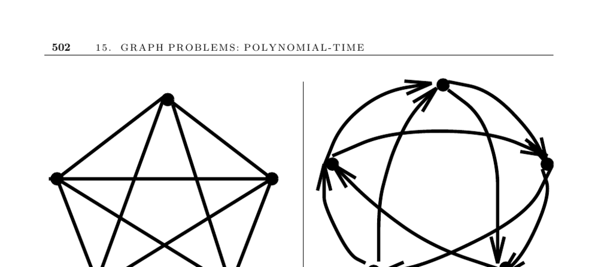

- **15.7 Eulerian Cycle/Chinese Postman**
  - **Problem description and motivation**
    - The problem seeks the shortest tour visiting each edge of a graph at least once.
    - Applications include garbage truck routes, snow plows, postmen deliveries, and validation of telephone menu systems.
    - The task aims to minimize total driving distance or time while covering every road.
    - Eulerian cycles exist if graphs meet specific connectivity and vertex degree conditions.
    - See Euler’s original problem and history in [BLW76].
  - **Eulerian cycle and path conditions**
    - An undirected graph has an Eulerian cycle if it is connected and all vertices have even degree.
    - An undirected graph has an Eulerian path if it is connected and exactly two vertices have odd degree.
    - A directed graph contains an Eulerian cycle if it is strongly connected and each vertex's in-degree equals its out-degree.
    - A directed graph contains an Eulerian path from x to y if it is connected and all vertices except x and y have equal in-degree and out-degree, with x and y differing by one.
    - Connectivity checks can be performed via DFS or BFS.
  - **Constructing Eulerian cycles**
    - Eulerian cycles can be constructed in linear time by repeatedly extracting edge-disjoint cycles and splicing them.
    - Deleting a cycle preserves the Eulerian degree conditions.
    - Fleury’s algorithm walks the graph avoiding bridges until no alternatives remain.
    - Euler’s tour technique is vital in parallel graph algorithms.
    - See [Eve79a] and [Luc91] for detailed algorithmic treatments.
  - **Chinese postman problem and solutions**
    - The Chinese postman problem generalizes Eulerian cycle problems to graphs not initially Eulerian.
    - It finds a minimum-length tour traversing every edge at least once by adding edges to make the graph Eulerian.
    - Adding edges corresponds to computing shortest paths between odd-degree vertices and constructing a minimum-weight perfect matching.
    - Directed graphs allow bipartite matching owing to degree imbalances.
    - The problem is NP-complete for mixed graphs combining directed and undirected edges.
    - Algorithms by Edmonds and Johnson [EJ73] solve the problem optimally for undirected/directed cases.
  - **Implementations and software**
    - Eulerian cycle implementations are common, but Chinese postman solutions are rarer.
    - The directed Chinese postman Java implementation by Thimbleby is available online.
    - GOBLIN C++ library supports Chinese postman for both directed and undirected graphs.
    - LEDA provides tools for Eulerian cycles, matching, and shortest paths.
    - Combinatorica includes Mathematica implementations for Eulerian cycles and de Bruijn sequences.
  - **Historical and theoretical notes**
    - Graph theory’s origin traces back to Euler’s 1736 solution to the seven bridges of Königsberg problem.
    - Euler proved that no Eulerian cycle exists if multiple vertices have odd degree.
    - Counting Eulerian cycles can be done efficiently; see [HP73].
    - The Chinese postman problem was introduced by Kwan [Kwa62].
    - De Bruijn sequences represent Eulerian cycles on graphs of strings and are used to construct shortest sequences containing all substrings.
    - Detailed de Bruijn sequence construction can be found in [PS03].
