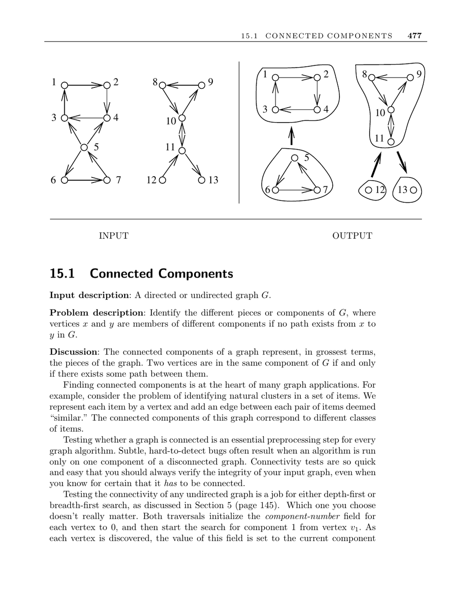

- **Connected Components**
  - **Input description and problem statement**
    - The input is a directed or undirected graph G.
    - The problem is to identify components where vertices x and y belong to different components if no path exists between them.
  - **Key concepts and applications**
    - Two vertices are in the same component if there exists some path between them.
    - Connected components identify natural clusters in sets of items based on similarity relationships modeled as edges.
    - Testing connectivity is a fundamental preprocessing step in graph algorithms to avoid subtle bugs.
  - **Algorithms for undirected graph connectivity**
    - Depth-first search (DFS) or breadth-first search (BFS) can identify connected components by labeling discovered vertices with component numbers.
    - The algorithm runs in O(n + m) time when using adjacency lists.
  - **Connectivity in directed graphs**
    - Weak connectivity disregards edge directions, while strong connectivity requires directed paths between every pair of vertices.
    - Weakly connected components can be found by turning directed edges into undirected ones and applying DFS.
    - Strong connectivity testing involves a two-DFS approach: one on the graph, one on the graph with reversed edges.
    - Strongly connected components form unique partitions of the vertices.
  - **Additional notions of connectivity**
    - Biconnected components relate to graph vulnerability when removing vertices disconnects the graph.
    - Biconnected components are found in linear time using DFS.
  - **Identifying trees and cycles**
    - A tree is a connected, cycle-free undirected graph with n − 1 edges for n vertices.
    - DFS can detect cycles via back edges, which define directed cycles in directed graphs.
    - Directed acyclic graphs (DAGs) have no cycles, making topological sorting applicable.
  - **Implementations and tools**
    - Graph implementations often include BFS and DFS to cover connectivity testing.
    - C++ Boost Graph Library, LEDA, JUNG, and JGraphT provide implementations for connected and strongly connected components.
    - The book’s accompanying library offers C implementations of basic connectivity algorithms.
  - **Historical and academic notes**
    - DFS dates back to the nineteenth century and was first used for maze pathfinding.
    - BFS was first reported for shortest path discovery by Moore in 1957.
    - Hopcroft and Tarjan established DFS as fundamental for efficient graph algorithms.
    - The first linear-time strongly connected components algorithm is due to Tarjan; Sharir and Kosaraju devised a simpler two-DFS method.
    - Further studies discuss improved algorithms for dense graphs and connectivity.
  - **Related problems**
    - Edge-vertex connectivity and shortest path problems relate to connected components.
    - See also [Boost Graph Library](http://www.boost.org/libs/graph/doc) for algorithm implementations.
