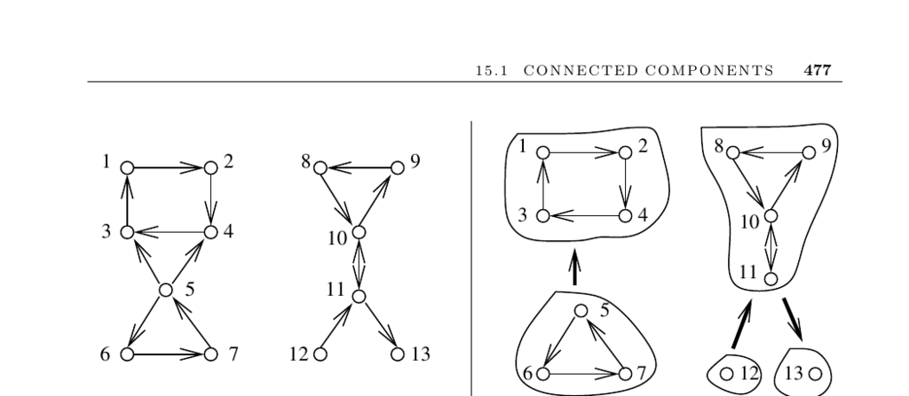

- **15.1 Connected Components**
  - **Input and Problem Description**
    - The input is a directed or undirected graph G.
    - The problem is to identify different components where no path exists between vertices in different components.
    - Connected components group vertices with an existing path between them.
  - **Connectivity Testing Algorithms**
    - Both depth-first search (DFS) and breadth-first search (BFS) test connectivity by labeling vertices with component numbers.
    - The algorithm runs in O(n + m) time using adjacency lists.
    - Algorithms for undirected graphs apply these traversals to find connected components.
    - See Section 5 (page 145) and Section 5.7.1 (page 166) for more on DFS/BFS.
  - **Connectivity in Directed Graphs**
    - Directed graphs have weakly connected components (connectivity ignoring edge directions) and strongly connected components (paths exist in both directions between vertices).
    - Weak connectivity can be tested by treating the graph as undirected.
    - Strong connectivity requires more complex tests such as two DFS traversals: one on the graph and one on the graph with all edges reversed.
    - The algorithm labels strongly connected components using DFS finishing times and reversed edges.
    - See Section 5.10.2 (page 181) for a single-pass implementation.
  - **Other Connectivity-Related Concepts**
    - Measuring graph robustness involves connectivity tests that identify how many vertices or edges must be removed to disconnect the graph.
    - Biconnected components arise from cutting edges at articulation points and can be found in linear time with DFS.
    - A tree is a connected, acyclic undirected graph characterized by having n − 1 edges.
    - Cycle detection in directed graphs identifies deadlocks via back edges in DFS.
    - See Section 5.9.2 (page 173) for biconnected components and Section 15.8 (page 505) for connectivity problems.
  - **Implementations and Libraries**
    - Graph data structures with BFS/DFS implementations support connectivity testing.
    - C++ Boost Graph Library provides connected and strongly connected component implementations.
    - LEDA offers biconnected, triconnected, and strongly connected components algorithms.
    - JUNG and JGraphT provide Java implementations for related connectivity algorithms.
    - The book includes a C language library with these algorithms (Section 19.1.10, page 661).
  - **Historical and Theoretical Notes**
    - DFS originated in the 19th century for maze pathfinding; BFS was introduced by Moore in 1957.
    - Hopcroft and Tarjan established DFS as a foundation for efficient graph algorithms.
    - Tarjan first developed a linear-time strongly connected components algorithm, with other algorithms by Sharir and Kosaraju offering simpler programming approaches.
    - For deeper study, see expositions in [CLRS01](https://mitpress.mit.edu/books/introduction-algorithms), [AHU83], and others referenced.
  - **Related Problems**
    - Edge-vertex connectivity and shortest path problems relate closely to connectivity and are discussed in Section 15.8 (page 505) and Section 15.3 (page 489) respectively.
