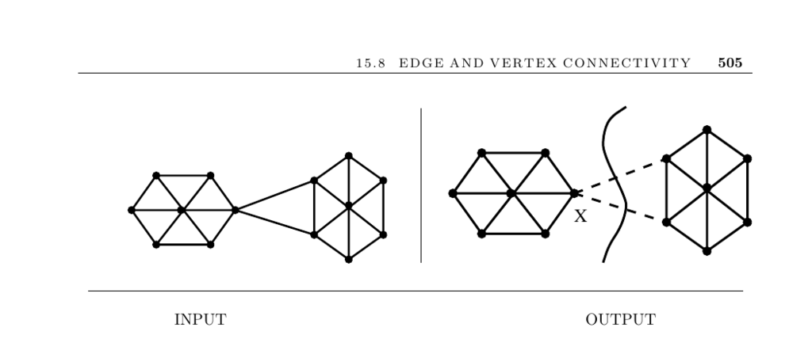

- **Edge and Vertex Connectivity**
  - **Input and Problem Description**
    - The input is a graph G, optionally including a pair of vertices s and t.
    - The problem seeks the smallest subset of vertices or edges whose deletion disconnects G or separates s from t.
    - Vertex connectivity is the minimum number of vertices to remove to disconnect the graph, while edge connectivity is the analogous measure for edges.
  - **Basic Connectivity Problems**
    - Testing if a graph is connected involves depth-first or breadth-first search identifying connected components in linear time.
    - Directed graph connectivity distinguishes between strong connectivity (a path exists between every vertex pair) and weak connectivity.
  - **Weak Links in Graphs**
    - A graph is biconnected if no single vertex removal disconnects it.
    - Articulation vertices and bridges are vertices or edges whose removal disconnects the graph.
    - Linear-time algorithms based on depth-first search exist for identifying articulation points and bridges.
  - **Graph Partitioning**
    - Partitioning seeks a small cut set dividing the graph into roughly equal-sized parts.
    - Used to split large systems (e.g., programs) into maintainable units by minimizing edges between parts.
    - The problem is NP-complete but solvable via heuristics.
  - **General vs. s–t Connectivity**
    - Two main problem types: finding the smallest cut for the entire graph or for separating a specific vertex pair s and t.
    - s–t connectivity algorithms applied over all pairs can solve general connectivity.
    - For edge connectivity, testing n−1 pairs suffices due to guaranteed separation.
  - **Network Flow Techniques**
    - Edge connectivity can be found via maximum flow computations, equating maximum flow between vi and vj with minimum disconnecting edge sets.
    - Vertex connectivity relates to Menger’s theorem, connecting it to vertex-disjoint paths.
    - A transformed graph G' is constructed to translate vertex connectivity to edge connectivity problems.
    - For more details, see [Section 15.9 Network Flow](page 509).
  - **Implementations and Libraries**
    - MINCUTLIB offers high-performance codes for multiple cut algorithms, available for noncommercial use.
    - Boost Graph Library provides connectivity and edge connectivity testing.
    - GOBLIN and LEDA libraries include extensive support for edge and vertex connectivity.
    - Combinatorica offers Mathematica implementations of connectivity problems.
  - **Theoretical Foundations and Algorithms**
    - Menger’s theorem and the max-flow min-cut theorem underpin correctness.
    - Karger's randomized contraction algorithm finds minimum cuts in expected O(m log^3 n) time.
    - Deterministic contraction algorithms exist with O(n(m + n log n)) runtime.
    - Experimental comparisons and heuristic improvements appear in [CGK+ 97].
    - Randomized algorithms are discussed in [Motwani and Raghavan 1995](https://example.org).
  - **Applications and Related Problems**
    - Minimum-cut methods apply to image segmentation and computer vision.
    - Specialized algorithms exist for small k-connectivity testing.
    - Related topics include connected components, network flow, and graph partitioning.
