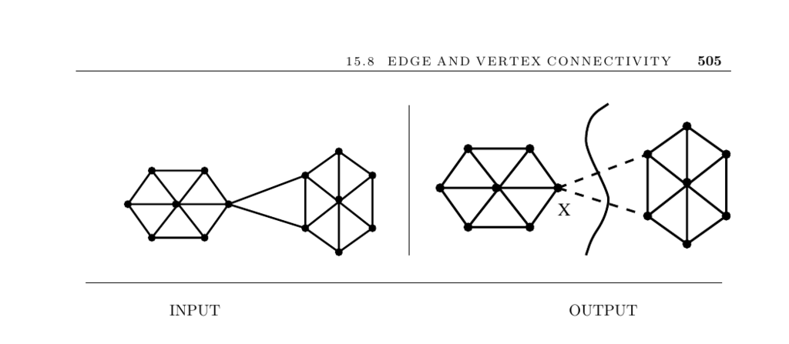

- **15.8 Edge and Vertex Connectivity**
  - **Input description and problem statement**
    - The input is a graph G, optionally with a specified vertex pair s and t.
    - The problem is to find the smallest subset of vertices or edges whose deletion disconnects G or separates s from t.
    - Edge connectivity measures the minimum edges to cut; vertex connectivity measures the minimum vertices to delete.
  - **Discussion of connectivity concepts and problems**
    - Vertex connectivity is always less than or equal to edge connectivity.
    - The minimum vertex degree bounds both edge and vertex connectivity from above.
    - Testing connectivity is achievable with DFS or BFS in linear time.
  - **Key connectivity problems and their analysis**
    - Identifying if the graph is disconnected or strongly/weakly connected.
    - Detecting articulation vertices (cut-vertices) and bridges (cut-edges) via DFS-based linear-time algorithms.
    - Seeking small cut sets to split graphs into roughly equal-sized components relates to the NP-complete graph partition problem.
    - Differentiating between global connectivity cuts and s–t specific cuts, with known bounds on number of runs needed.
  - **Network flow methods for connectivity**
    - Maximum flow between two vertices equals the weight of the smallest edge cut disconnecting them.
    - Edge connectivity can be found by minimizing flows between a fixed vertex and all others.
    - Vertex connectivity uses Menger’s theorem relating k-connectivity to k vertex-disjoint paths.
    - Construction of an auxiliary graph G' models vertex connectivity as edge connectivity for flow computations.
  - **Implementations and software libraries**
    - MINCUTLIB offers high-performance cut algorithms including network flow and contraction methods.
    - Boost Graph Library includes connectivity and edge connectivity implementations.
    - GOBLIN and LEDA provide extensive C++ support for connectivity and minimum-cut problems.
    - Combinatorica offers Mathematica implementations of edge and vertex connectivity along with articulation points and bridges.
  - **Notes and advanced algorithms**
    - The network-flow approach correctness relies on Menger’s theorem and the max-flow min-cut theorem by Ford and Fulkerson.
    - Karger’s randomized contraction algorithm finds minimum cuts in expected O(m log³ n) time.
    - Deterministic contraction algorithms improve runtime using edges guaranteed not in minimum cuts.
    - Minimum cut methods apply to computer vision tasks like image segmentation.
    - Specialized algorithms exist for edge k-connectivity, with linear time methods for 3-connected components and O(n²) for 4-connectivity.
  - **Related problems**
    - Connected components.
    - Network flow.
    - Graph partition.
