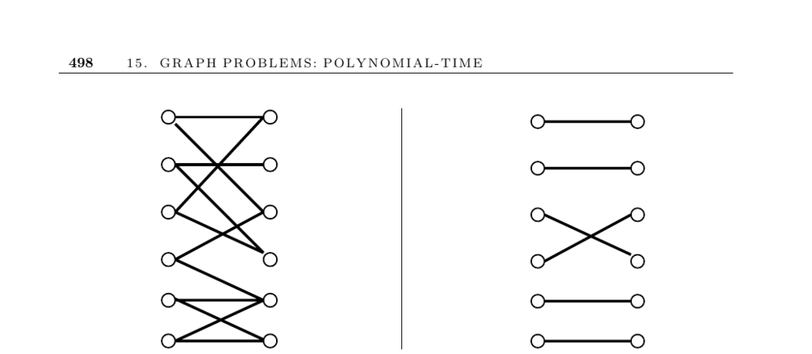

- **Matching**
  - **Input description**
    - The input is a (weighted) graph G = (V, E).
    - The problem requires finding the largest set of edges E′ such that each vertex in V is incident to at most one edge in E′.
  - **Problem description**
    - The goal is to find a maximum matching, where no vertex is repeated in the matched edges.
    - Applications include assigning tasks to workers so no worker is overloaded.
  - **Discussion and applications**
    - Matching is a powerful algorithmic tool widely applicable across domains.
    - Common applications include bipartite matching, such as pairing boys to compatible girls or rearranging characters in a string.
    - The matching framework can be extended to handle multiple jobs per employee by vertex replication.
    - Weighted matching seeks to maximize total suitability scores rather than just cardinality.
    - [Lovász and Plummer's book](https://books.google.com/books?id=4f6UyX1i1XIC) is a definitive reference on matching theory.
  - **Algorithms and theory**
    - Maximum cardinality matching is computed via augmenting paths that alternate between matched and unmatched edges.
    - Berge’s theorem states no augmenting path exists if and only if the matching is maximum.
    - Bipartite graphs exclude odd-length cycles, simplifying matching algorithms.
    - Network flow transformations enable maximum bipartite matching solutions.
    - Edmond’s algorithm solves general graph matching including blossoms (odd cycles).
    - Hopcroft-Karp algorithm runs in O(√n m) time for bipartite graphs.
    - The Hungarian algorithm solves weighted bipartite matching efficiently.
    - [CLRS book](https://mitpress.mit.edu/books/introduction-algorithms-third-edition) contains expositions on network flow and matching.
  - **Implementations**
    - High-performance implementations include Goldberg’s CSA for weighted matching and Cherkassky’s BIM for unweighted bipartite matching.
    - The DIMACS Implementation Challenge collected multiple solvers in various languages.
    - GOBLIN and LEDA libraries provide C++ implementations for matching problems.
    - Blossom IV and other codes implement efficient algorithms for weighted and unweighted matching in general graphs.
    - [DIMACS repository](http://dimacs.rutgers.edu/pub/netflow/matching) offers code and instance generators.
  - **Notes and related theory**
    - Maximum matching size equals minimum vertex cover size in bipartite graphs.
    - Stable matching problems, distinct from maximum matching, guarantee at least one stable solution found in O(n²) time.
    - Stable marriage problems model real-life applications like medical resident matching.
    - The theory of stable matching is fully treated in [Gale and Shapley's work](https://math.mit.edu/~gs/).
    - Related problems include Eulerian cycles and network flows as described in referenced sections.
