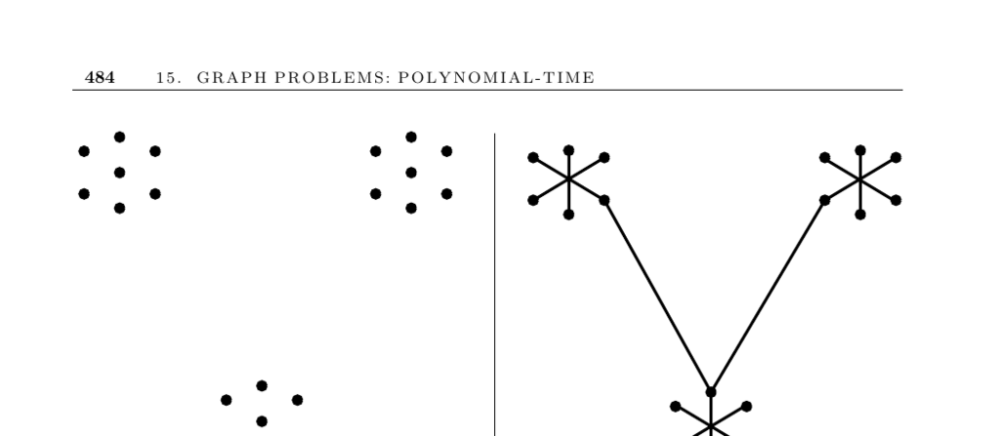

- **Minimum Spanning Tree**
  - **Problem Description and Applications**
    - The MST is the minimum weight subset of edges that forms a tree spanning all vertices in a graph.  
    - MST algorithms identify clusters by deleting long edges and help approximate solutions to hard problems like Steiner tree and traveling salesman.  
    - MST algorithms serve as educational tools demonstrating the effectiveness of greedy algorithms.  
    - Telephone companies use MST to design wiring schemes minimizing cable length.  
  - **Classical MST Algorithms**
    - Three classical algorithms efficiently compute MSTs: Kruskal’s, Prim’s, and Boruvka’s.  
    - Kruskal’s algorithm sorts edges and adds the lowest weight edges connecting separate subtrees while avoiding cycles.  
    - Prim’s algorithm grows the MST from an arbitrary vertex by adding the lowest-cost edge connecting fringe vertices.  
    - Boruvka’s algorithm repeatedly adds the lowest-weight edge incident to each tree in a forest, halving the number of trees each iteration.  
  - **Algorithm Details and Complexity**
    - Kruskal’s algorithm, using union-find, runs in O(m log m) time.  
    - Prim’s algorithm can be implemented in O(n²) time or O(m + n log n) with advanced priority queues.  
    - Boruvka’s algorithm runs in O(m log n) time without complex data structures.  
    - Combining Boruvka’s and Prim’s algorithms can yield an O(m log log n) MST algorithm.  
  - **When to Use Which Algorithm**
    - Prim’s is faster on dense graphs; Kruskal’s is preferred for sparse graphs.  
    - Prim’s with pairing heaps offers practical efficiency for both dense and sparse graphs.  
    - Unweighted graphs allow any spanning tree to be minimal, obtainable via BFS or DFS in linear time.  
    - For planar point sets, building the Delaunay triangulation speeds MST computation to O(n log n).  
  - **Spanning Trees with Constraints**
    - Finding a spanning tree with maximum degree 2 is NP-complete (equivalent to Hamiltonian path).  
    - Approximation algorithms exist for spanning trees with nearly minimum maximum degree.  
  - **Implementations and Libraries**
    - Prim’s and Kruskal’s are implemented in major graph libraries such as Boost Graph Library and LEDA.  
    - Empirical studies favor Prim’s with appropriate priority queues as the fastest method on most graphs.  
    - Mathematica implementations are available via Combinatorica.  
  - **Historical Context and Advanced Results**
    - The MST problem dates back to Boruvka in 1926, with Prim’s and Kruskal’s algorithms published in the mid-1950s.  
    - Advanced MST algorithms use Fibonacci and pairing heaps to improve practical performance.  
    - The fastest known algorithms include randomized linear-time methods and algorithms with inverse Ackermann function complexity.  
    - MST problems relate to matroid theory and greedy algorithms as established by Edmonds.  
  - **Related Problems and Extensions**
    - MST relates closely to problems like Steiner tree and traveling salesman.  
    - Spanner networks are subgraphs balancing total weight and shortest-path approximations, related to MST.  
    - Dynamic graph algorithms maintain MSTs efficiently under edge updates.  
    - Algorithms exist for generating spanning trees in order from minimum to maximum weight and for enumerating all spanning trees in constant amortized time.  
  - **References for Further Reading**
    - [Boost Graph Library](http://www.boost.org/libs/graph/doc) for implementations.  
    - [Combinatorica](https://library.wolfram.com/infocenter/MathSource/7450/) for Mathematica algorithms.  
    - [Narashimhan and Smid’s monograph on spanner networks](https://link.springer.com/book/10.1007/978-3-540-44188-4).  
    - [Wu and Chao’s monograph on MSTs](https://www.springer.com/gp/book/9781441918428).  
    - Edmonds, J. "Matroids and greedy algorithms" (1971) for matroid connections.
