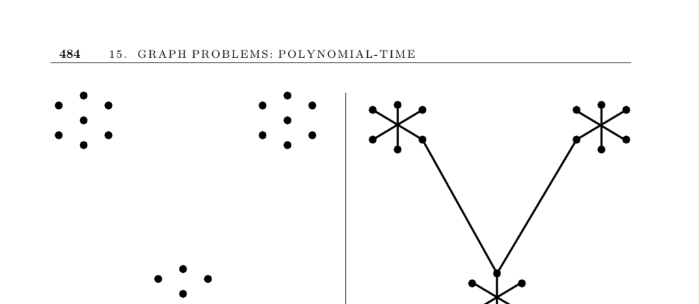

- **Minimum Spanning Tree**
  - **Problem Description**
    - The MST is the minimum weight subset of edges forming a tree on the vertex set of a weighted graph.
    - It is crucial for maintaining connectivity with minimal total edge weight.
    - MST applications include network design (e.g., telephone wiring) and data clustering.
    - MST algorithms demonstrate that greedy approaches can yield optimal solutions.
    - For further reading, see [MST and Network Design](https://en.wikipedia.org/wiki/Minimum_spanning_tree).
  - **Classical Algorithms**
    - Three efficient MST algorithms are Kruskal’s, Prim’s, and Boruvka’s.
    - Kruskal’s uses sorting edges and union-find, running in O(m log m).
    - Prim’s grows a tree from an arbitrary vertex, running in O(n²) with basic structures and faster with advanced data structures.
    - Boruvka’s repeatedly merges components by adding smallest incident edges, running in O(m log n).
    - See Section 6.1 and union-find details in Section 12.5 for implementations.
  - **Implementation Details**
    - Kruskal’s tests for cycles use union-find to achieve efficiency.
    - Prim’s tracks vertices as tree, fringe, or unseen during edge selection.
    - Boruvka’s halves the number of trees each iteration, using linear time per round.
    - Implementations exist in Boost Graph Library, LEDA, and JDSL.
    - Prefer advanced data structures like pairing heaps for best practical performance.
  - **Algorithm Selection Guidance**
    - For unweighted graphs, any spanning tree suffices as MST.
    - Prim’s is faster on dense graphs; Kruskal’s is faster on sparse graphs.
    - Geometric MSTs in 2D use Delaunay triangulation plus Kruskal’s to achieve O(n log n).
    - Finding spanning trees minimizing maximal vertex degree is NP-complete but approximations exist.
  - **Advanced Topics and Theoretical Results**
    - Combining Boruvka’s and Prim’s yields an O(m log log n) MST algorithm.
    - The best known algorithms use randomized or near-linear time methods (e.g., Karger-Klein-Tarjan).
    - MST problems relate to matroids, allowing greedy algorithm characterization.
    - Dynamic MST algorithms maintain MSTs under graph updates efficiently.
    - For further reading, [MST algorithms survey](https://hal.inria.fr/inria-00120614/document) and [Matroid Theory](https://en.wikipedia.org/wiki/Matroid).
  - **Related Problems**
    - Steiner tree and traveling salesman are related complex problems addressed with MST approximations.
    - See pages 533 and 555 for detailed discussions.
