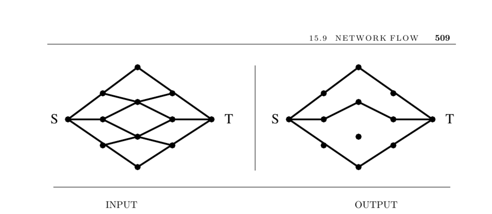

- **Network Flow**
  - **Input Description**
    - The problem input is a directed graph G with edge capacities for each directed edge (i, j).
    - A source node s and a sink node t are provided.
    - The objective is to maximize the flow routed from s to t without exceeding edge capacities.
  - **Problem Description**
    - Seeks the maximum flow from source to sink while respecting capacity constraints of each edge.
    - The maximum flow problem models a wide range of applications beyond physical flow, including resource allocation in communication networks.
  - **Key Concepts**
    - Maximum Flow involves variables xij denoting flow through edges constrained by capacities.
    - Flow conservation requires the sum of flows into and out of each node (except s and t) to be equal.
    - Minimum Cost Flow extends maximum flow by adding per-unit flow costs, with a target flow amount.
  - **Special Considerations**
    - Multiple sources/sinks can be handled by introducing super-source and super-sink nodes.
    - Identical arc capacities (0 or 1) allow faster, specialized algorithms.
    - Identical edge costs simplify the problem to maximum flow.
    - Multicommodity flow models multiple types of flow, but integer solutions are NP-complete.
  - **Algorithmic Approaches**
    - Augmenting path methods find paths with positive capacity repeatedly to increase flow.
    - Preflow-push methods push flow from one vertex to another, ignoring flow conservation temporarily for efficiency.
    - Preflow-push algorithms generally outperform augmenting path algorithms.
  - **Implementations**
    - Recommended maximum flow codes include HIPR and PRF by Andrew Goldberg and collaborators.
    - CS code is preferred for minimum-cost flow problems.
    - Other libraries include GOBLIN and LEDA, providing extensive graph optimization features.
    - The DIMACS Implementation Challenge offers various implementations in C, such as Rothberg's preflow-push and Dinic/Karzanov algorithms.
  - **Notes and Further Reading**
    - The foundational book on network flows is [AMO93].
    - Additional algorithmic expositions appear in [CCPS98], [CLRS01], and [PS98].
    - Multicommodity flow hardness is covered by [Eve79a].
    - The maximum-flow, minimum-cut theorem is due to Ford and Fulkerson [FF62].
    - The fastest known maximum flow algorithm runs in O(nm lg(n²/m)) time [GT88].
    - Network coding theory achieves information flow at max-flow min-cut limits [YLCZ05].
