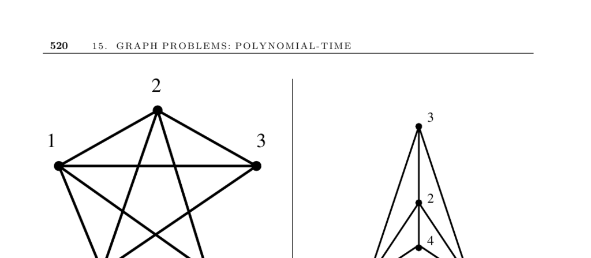

- **15.12 Planarity Detection and Embedding**
  - **Input description**
    - The input is a graph \( G \).
  - **Problem description**
    - The problem asks if \( G \) can be drawn in the plane without edge crossings.
    - If possible, the output is a planar drawing of \( G \).
  - **Discussion**
    - Planar graphs highlight structure by avoiding crossing edges which can be confused as vertices.
    - Real-world examples include road networks and printed circuit layouts which are inherently planar.
    - Every planar graph satisfies Euler’s formula: \(|E| \leq 3|V| - 6\), limiting edge count and ensuring sparsity.
    - Planar graphs always contain vertices with degree \(\leq 5\), enabling vertex deletion sequences for algorithms.
    - Subgraphs of planar graphs are also planar, enabling recursive approaches.
    - Planarity testing algorithms start with embedding an arbitrary cycle and incrementally add paths, detecting crossing conflicts.
    - Mutual path crossings prove non-planarity.
    - Linear-time planarity tests leverage depth-first search but are complex.
    - Incremental embedding can lead to cramped drawings; better approaches use planar-grid embeddings with bounded vertex placement on a \((2n-4) \times (n-2)\) grid.
    - Minimizing crossings in nonplanar graphs is NP-complete; heuristics seek large planar subgraphs and insert remaining edges.
  - **Implementations**
    - LEDA provides linear-time planarity tests and planar-grid embeddings, returning Kuratowski subgraphs for nonplanar graphs.
    - JGraphEd offers Java implementations including Booth-Lueker PQ-tree and straight-line grid embeddings.
    - PIGALE is a C++ library focused on planar graphs, providing planarity tests and obstruction identification.
    - GRASP heuristics by Ribeiro and Resende find large planar subgraphs and are available via ACM Algorithm 797.
  - **Notes**
    - Kuratowski’s theorem characterizes planar graphs by excluding subgraphs homeomorphic to \( K_{3,3} \) or \( K_5 \).
    - Fary’s theorem guarantees straight-line planar drawings for planar graphs.
    - Key algorithms include Hopcroft and Tarjan’s linear-time planarity test and Booth and Lueker’s PQ-tree method.
    - Efficient planar grid embeddings were pioneered by de Fraysseix, Pach, and Pollack.
    - Nishizeki and Rahman’s book gives a comprehensive overview of planar drawing algorithms.
    - Outerplanar graphs are characterized by absence of \( K_{2,3} \)-homeomorphs, testable and embeddable in linear time.
  - **Related Problems**
    - Planarity testing relates to graph partition and tree drawing problems.
  - **Further reading**
    - [Algorithm Repository - Planarity Detection](http://www.cs.sunysb.edu/~algorith)
    - [LEDA Library](https://www.algorithmic-solutions.com/en/leda.htm)
    - [JGraphEd](http://www.jharris.ca/JGraphEd/)
    - [PIGALE Project](http://pigale.sourceforge.net/)
    - Ribeiro and Resende GRASP heuristic ACM Algorithm 797  
    - Nishizeki and Rahman, *Planar Graph Drawing Algorithms* (2004)
