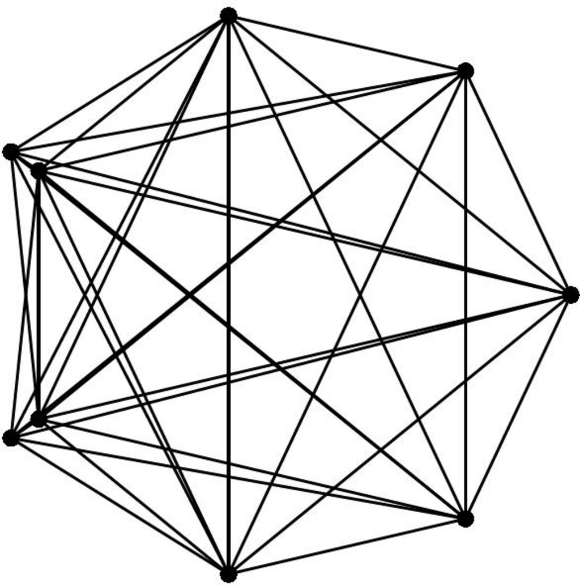

- **Graph Problems: Polynomial-Time**
  - **Connected Components**
    - Identify distinct pieces or components of a graph where vertices have no connecting path.
    - Use depth-first or breadth-first search running in O(n + m) time for undirected graphs.
    - Directed graphs have weakly and strongly connected components with linear-time algorithms.
    - Related invariants include biconnected components and cycle detection in trees and DAGs.
    - Recommended resources include Boost Graph Library and Handbook of Graph Algorithms.
  - **Topological Sorting**
    - Find a linear ordering of vertices in a directed acyclic graph such that edges go from left to right.
    - Every DAG can be topologically sorted; only DAGs can be sorted.
    - Algorithms run in O(n + m) time using DFS or queue-based methods.
    - Counting or listing all linear extensions is #P-complete and requires backtracking algorithms.
    - Refer to [CLRS01] and [BW91] for foundational materials.
  - **Minimum Spanning Tree**
    - Find the subset of edges forming a tree connecting all vertices with minimum total weight.
    - Classical algorithms are Kruskal’s, Prim’s, and Boruvka’s, with varying implementations and complexities.
    - MSTs have applications in clustering, approximation problems, and network design.
    - Geometric MSTs for planar points use Delaunay triangulation for efficient computation.
    - See [AMO93] and [KKT95] for advanced algorithms and theory.
  - **Shortest Path**
    - Compute shortest paths between vertices in an edge-weighted graph.
    - Dijkstra’s algorithm handles positive weights; Bellman-Ford handles negative weights but no negative cycles.
    - Unweighted graphs use BFS; DAGs enable linear-time shortest path via topological order.
    - Floyd-Warshall solves all-pairs shortest paths in O(n³) time.
    - Applications include routing, image segmentation, and graph centers; high-performance codes available ([Gol01]).
  - **Transitive Closure and Reduction**
    - Transitive closure adds edges to represent reachability; reduction removes redundant edges preserving reachability.
    - Algorithms include n DFS per vertex (O(n(n + m))), Warshall’s O(n³) algorithm, and matrix multiplication.
    - Strongly connected components reduce problem size; minimum size transitive reduction is NP-complete if edges must be from the original graph.
    - Heuristics exist for quick approximate transitive reductions.
    - Consult [vL90a] and [Nuu95] for surveys and advanced techniques.
  - **Matching**
    - Find the largest set of edges with no shared vertices in weighted or unweighted graphs.
    - Bipartite matching has specialized, efficient algorithms; general graph matching is more complex.
    - Augmenting paths are central to maximum matching algorithms; weighted problems solved by Hungarian method.
    - Applications span job assignments, string rearrangements, and stable marriages.
    - Authoritative texts include [LP86] and network flow literature.
  - **Eulerian Cycle/Chinese Postman**
    - Find a tour visiting every edge of the graph at least once with minimum total length.
    - Eulerian cycles exist if degree conditions are met; otherwise, the Chinese postman problem adds edges to make the graph Eulerian.
    - Minimum weight perfect matching on odd-degree vertices is used to augment the graph.
    - Applications include garbage collection routes and telephone menu testing.
    - Refer to [Eul36], [EJ73], and [Thi03] for algorithms and implementations.
  - **Edge and Vertex Connectivity**
    - Determine the smallest set of edges or vertices whose removal disconnects the graph.
    - Connectivity derives from network reliability concepts (e.g., bombing nodes or cutting edges).
    - Use network flow and Menger’s theorem to compute connectivity.
    - Faster algorithms utilize graph contraction methods, e.g., Karger’s randomized algorithm.
    - Consult [CGK+97], [Kar00], and classical network flow literature.
  - **Network Flow**
    - Maximize flow from source to sink in a directed graph respecting edge capacities.
    - Also consider minimum cost flow with added edge costs and multicommodity flows.
    - Algorithm classes include augmenting path and preflow-push methods.
    - Model applications include resource allocation, transportation, matching, and connectivity.
    - Recommended literature: [AMO93], [Gol97], and [CG94], with available high-performance codes.
  - **Drawing Graphs Nicely**
    - Create aesthetically pleasing drawings that reflect graph structure while minimizing crossings and optimizing edge lengths and angles.
    - Criteria such as planar embedding, edge styles (straight or polyline), and label placement influence algorithms.
    - General-purpose heuristics include circular layouts and spring embeddings.
    - Good commercial and open-source tools include GraphViz and JGraphT.
    - Refer to the Handbook of Graph Drawing and Visualization [Tam08] and [BETT99].
  - **Drawing Trees**
    - Produce clear visualizations of trees, distinguishing rooted and free trees.
    - Rooted trees use ranked or radial embeddings reflecting hierarchy or distance from the center.
    - Trees are planar, allowing cycle-free drawings.
    - Tree centers can be found in linear time to improve layout.
    - See [BETT99], [KW01], and [BJL06] for state-of-the-art algorithms.
  - **Planarity Detection and Embedding**
    - Test whether a graph can be drawn without edge crossings and produce such a drawing if possible.
    - Planar graphs satisfy Euler’s formula and have a linear number of edges.
    - Linear-time planarity testing algorithms rely on depth-first search and path-crossing detection.
    - Grid embeddings avoid cramping and preserve planar properties.
    - Tools include LEDA and PIGALE; see [Kur30] and [HT74] for foundational proofs and algorithms.
