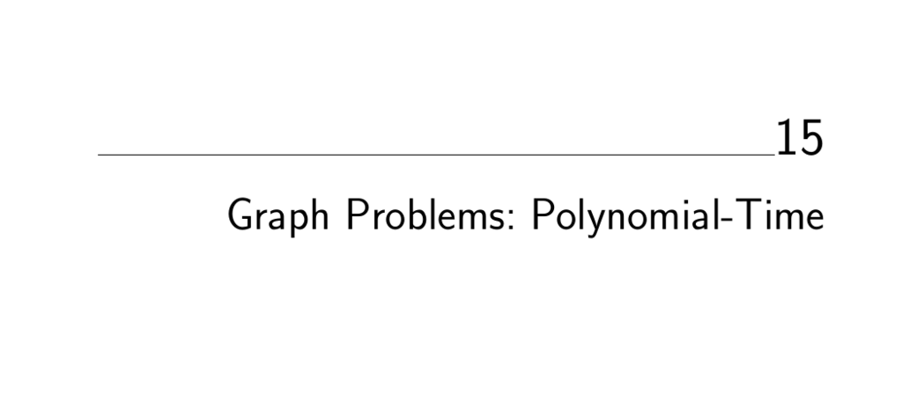

- **Graph Problems: Polynomial-Time**
  - **15.1 Connected Components**
    - Identify different components of a graph where vertices have no path between them.
    - Both depth-first and breadth-first search can find connected components in O(n + m) time.
    - Directed graphs have weakly and strongly connected components, found using DFS and edge reversals.
    - Biconnected components identify vertices whose removal disconnects the graph.
    - See [Handbook of Graph Algorithms](https://example.org) for detailed surveys.
  - **15.2 Topological Sorting**
    - Find a linear ordering of vertices in a directed acyclic graph so edges go from left to right.
    - Topological sorting exists only for DAGs and can be found in O(n + m) time.
    - Listing all linear extensions is exponential and NP-hard; backtracking and random sampling can generate them.
    - Feedback vertex and arc sets remove cycles to produce DAGs but are NP-complete.
    - Refer to [CLRS Book](https://example.org) for algorithmic details.
  - **15.3 Minimum Spanning Tree**
    - Find the minimum weight subset of edges connecting all vertices without cycles.
    - Classical algorithms include Kruskal’s, Prim’s, and Boruvka’s with complexities ranging from O(m log m) to O(n²).
    - MSTs can cluster points by cutting long edges and approximate harder problems like Steiner tree.
    - Geometric MSTs employ Delaunay triangulation for improved efficiency.
    - Consult [AMO93 Network Flows](https://example.org) for further reading.
  - **15.4 Shortest Path**
    - Determine the shortest path between two vertices in an edge-weighted graph.
    - Use BFS for unweighted, Dijkstra’s algorithm for positive weights, and Bellman-Ford for graphs with negative weights.
    - All-pairs shortest paths can be found with Floyd-Warshall in O(n³) time.
    - Applications include routing, image segmentation, and speech recognition.
    - See [Goldberg’s implementations](http://www.avglab.com/andrew/soft.html) for high-performance solutions.
  - **15.5 Transitive Closure and Reduction**
    - Transitive closure finds paths reachable between all vertex pairs; transitive reduction minimizes edges while preserving reachability.
    - Algorithms include DFS from each vertex (O(n(n + m))), Warshall’s algorithm (O(n³)), and matrix multiplication techniques.
    - Transitive reductions are unique for closure but minimal reductions are NP-complete if edge removal restricted to original edges.
    - Strongly connected components reduce problem size effectively.
    - For surveys, see van Leeuwen [vL90a].
  - **15.6 Matching**
    - Find a largest set of edges with no shared vertices, optionally weighted for maximum cost matching.
    - Bipartite graphs admit faster algorithms, including network flow reductions and Hungarian algorithm.
    - General graphs require augmenting path and blossom algorithms.
    - High-performance implementations available from Goldberg et al. and LEDA.
    - See [Lovász and Plummer LP86] for fundamental theory.
  - **15.7 Eulerian Cycle/Chinese Postman**
    - Eulerian cycle visits every edge exactly once; exists if graph is connected and vertices have even degree.
    - Chinese postman problem finds shortest tour covering every edge at least once by adding edges to make the graph Eulerian.
    - Uses shortest paths between odd-degree vertices and minimum-weight perfect matching.
    - Linear-time constructions exist for Eulerian cycles.
    - Historical and algorithmic details in [Edmonds and Johnson EJ73].
  - **15.8 Edge and Vertex Connectivity**
    - Determine smallest vertex or edge sets whose removal disconnects the graph or separates specified vertices.
    - Connectivity can be tested with DFS/BFS; biconnected components identify articulation points and bridges.
    - Network flow algorithms find minimal edge cuts; Menger’s theorem connects vertex connectivity to vertex-disjoint paths.
    - Fastest algorithms use graph contraction techniques.
    - See [Chekuri et al. CGK+97] for experimental algorithm analyses.
  - **15.9 Network Flow**
    - Maximize flow from source to sink respecting edge capacities; min-cost flow adds edge costs with flow objectives.
    - Supports multiple sources/sinks via super-vertices and multicommodity flows when handling multiple commodities.
    - Augmenting path and preflow-push are primary algorithm classes.
    - Recommended high-performance codes by Goldberg et al. available online.
    - Seminal reference: [Ahuja, Magnanti, and Orlin AMO93].
  - **15.10 Drawing Graphs Nicely**
    - Algorithmically produce drawings reflecting graph structure with aesthetic criteria like minimizing crossings and controlling area and edge length.
    - Perfect drawings are usually impossible; heuristics include circular layouts and spring embeddings modeling vertex attraction and repulsion.
    - Edge/vertex label placement is NP-complete but manageable with heuristics.
    - Tools include GraphViz and commercial graph drawing software.
    - For comprehensive surveys, see the [Handbook of Graph Drawing](https://example.org).
  - **15.11 Drawing Trees**
    - Trees, cycle-free graphs, can be drawn rooted (hierarchical) or free (no root).
    - Rooted trees use ranked (top-down strips) or radial (concentric angular sectors) embeddings.
    - Free trees may be rooted at the tree center to improve drawing quality.
    - Trees always admit planar drawings without edge crossings.
    - Consult [Buchheim et al. BJL06] for advanced layout heuristics in trees.
  - **15.12 Planarity Detection and Embedding**
    - Determine if a graph can be drawn with no edge crossings; if so, produce a planar embedding.
    - Planar graphs are sparse (|E| ≤ 3|V| - 6) and admit low-degree vertex deletion sequences.
    - Linear-time planarity testing algorithms use DFS and path crossing considerations.
    - Planar embeddings can be constructed incrementally or using grid embedding with bounded area.
    - Tools include LEDA and PIGALE; Kuratowski's theorem characterizes nonplanar graphs.
    - For detailed theory see [Nishizeki and Rahman NR04].
