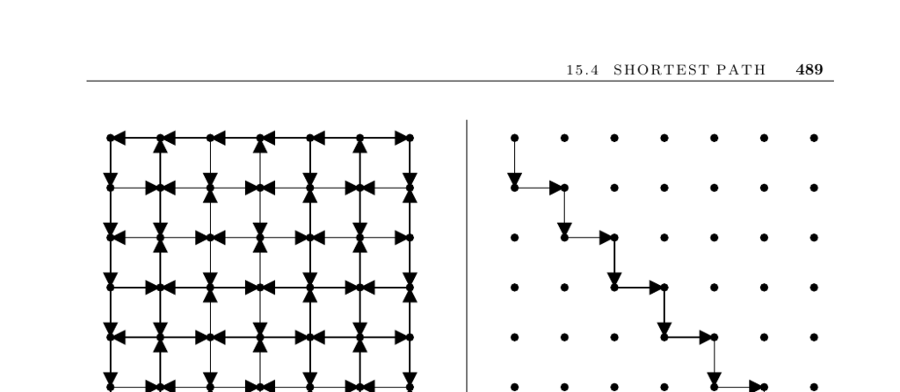

- **Shortest Path Problem**
  - **Problem Description and Applications**
    - The goal is to find the shortest path between two vertices s and t in an edge-weighted graph G.
    - Applications include transportation routing, image segmentation, speech recognition, and graph visualization.
    - Graph vertices can represent objects like pixels or phoneme interpretations, and edge weights capture costs or likelihoods.
    - The shortest path defines optimal transitions or boundaries in various domains.
  - **Dijkstra’s Algorithm**
    - Computes shortest paths from a source vertex x to all others using a growing set S of vertices with known shortest paths.
    - Iteratively selects an edge (u, v) minimizing dist(x, u) + weight(u, v) to expand S.
    - Runs in O(n²) time, with faster variants using advanced data structures, suitable only for positive edge weights.
    - Terminates early when the target vertex y is reached if only s-to-t path is needed.
  - **Algorithm Selection Based on Graph Properties**
    - Use breadth-first search for unweighted graphs to find shortest paths in linear time.
    - Use Bellman-Ford algorithm for graphs with negative edge weights but no negative cycles.
    - For directed acyclic graphs (DAGs), find shortest paths in linear time via topological sorting and dynamic programming.
    - Use geometric shortest-path algorithms for obstacle-filled environments, or convert geometry problems into graphs.
  - **All-Pairs Shortest Paths**
    - Running Dijkstra’s algorithm n times solves all-pairs shortest path but can be inefficient.
    - Floyd-Warshall algorithm uses dynamic programming in O(n³) to find all shortest paths, handling negative edges but not negative cycles.
    - The distance matrix updates by considering paths through intermediate vertices incrementally.
  - **Finding Shortest Cycles (Girth)**
    - The girth is the length of the shortest cycle in the graph.
    - Floyd-Warshall can detect shortest cycles by examining diagonal entries dii representing cycles through vertex i.
    - The shortest simple cycle can be found via shortest path computations plus edge checks.
    - Finding longest cycles is NP-complete due to Hamiltonian cycle inclusion.
  - **Graph Center, Radius, and Diameter**
    - The eccentricity of a vertex is the maximum shortest-path distance to any other vertex.
    - The radius is the minimum eccentricity among all vertices.
    - The center is the set of vertices with eccentricity equal to the radius.
    - The diameter is the maximum eccentricity across all vertices.
  - **Implementation and Performance**
    - High-performance implementations like MLB provide near BFS speeds for positive integer weights on large graphs.
    - Libraries such as Boost Graph Library and LEDA offer implementations of Dijkstra, Bellman-Ford, and Floyd-Warshall.
    - Experimental studies and heuristics improve practical performance, e.g., using Fibonacci heaps or A* for point-to-point queries.
    - The 9th DIMACS Challenge focused on shortest path algorithm implementations and benchmarks.
  - **Related Topics and Further Reading**
    - Network flow problems and geometric motion planning relate closely to shortest path computations.
    - The text references surveys and expositions such as [CLRS01], [Zwi01], and [PN04] for more algorithmic details.
    - Algorithms like A* and k-shortest-path provide extensions and variants for more specialized applications.
    - Online services like Mapquest employ approximate algorithms leveraging preprocessing and highway structures for scale.
    - Research contexts and software resources are available at the DIMACS Challenge website (http://dimacs.rutgers.edu/Challenges/).
