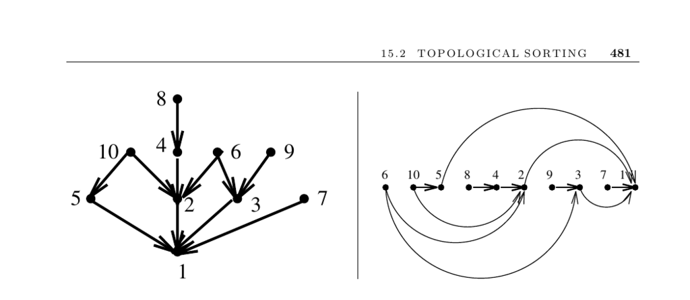

- **Topological Sorting**
  - **Input description**
    - The input is a directed acyclic graph (DAG) G = (V, E), representing a partial order or poset.
    - The problem is to find a linear ordering of vertices so each edge (i, j) places i to the left of j.
  - **Problem description**
    - Topological sorting orders vertices and edges of a DAG consistently.
    - The task is to find a linear extension respecting all precedence constraints.
    - Topological sorting applies to scheduling tasks with precedence relations.
  - **Discussion**
    - Only DAGs can be topologically sorted due to the absence of directed cycles.
    - Every DAG has at least one topological ordering.
    - Many DAGs admit multiple different topological sorts when constraints are few.
  - **Algorithms**
    - The simplest linear-time algorithm repeatedly removes source vertices (in-degree zero).
    - Deleting outgoing edges of source vertices reveals new sources to continue ordering.
    - An alternate approach uses decreasing DFS finishing times to yield a linear extension.
    - Both approaches run in O(n + m) time, where n is vertices and m is edges.
  - **Special considerations**
    - Listing all linear extensions may be desired but is costly since the number can grow exponentially.
    - Algorithms for all linear extensions use backtracking, selecting in-degree zero vertices iteratively.
    - Counting or listing linear extensions is #P-complete, hence computationally hard.
    - Random linear extensions can be sampled by exchanging pairs in a known topological ordering.
    - If the graph has cycles, removing feedback vertex or arc sets can restore a DAG, but these problems are NP-complete.
    - Heuristics can remove offending edges or vertices to continue topological sorting.
  - **Implementations**
    - Topological sorting is included in many graph libraries, such as Boost Graph Library and LEDA for C++.
    - Java libraries like JDSL and JGraphT provide routines for topological sorting.
    - The Combinatorial Object Server offers C programs for generating and counting linear extensions.
    - The book's associated C library includes implementations for basic graph algorithms including topological sorting.
  - **Notes**
    - Counting linear extensions is #P-complete, a complexity class related to NP-hardness.
    - Specialized algorithms exist to generate linear extensions in constant amortized time by adjacent transpositions.
    - Reverse search techniques enable enumeration of linear extensions.
    - Sampling linear extensions uniformly at random can be done in expected O(n³ log n) time.
    - Recommended references include [CLRS01] and Brightwell and Winkler [BW91].
  - **Related Problems**
    - Related topics include general sorting and feedback vertex/arc set problems.
