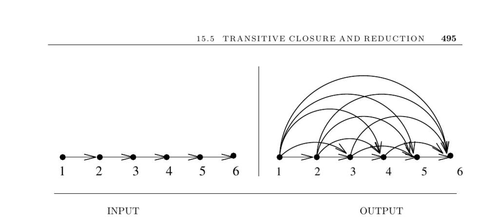

- **15.5 Transitive Closure and Reduction**
  - **Input and Problem Description**
    - The input is a directed graph G = (V, E).
    - Transitive closure constructs a graph G* = (V, E*) where edge (i, j) exists if there is a directed path from i to j in G.
    - Transitive reduction constructs a minimal graph G* = (V, E*) preserving reachability identical to G.
  - **Transitive Closure Algorithms**
    - Breadth-first or depth-first search from each vertex yields O(n(n + m)) time, suitable for sparse graphs.
    - Warshall’s algorithm computes closure in O(n³) time using a dynamic programming matrix approach similar to Floyd’s algorithm.
    - Matrix multiplication computes closure by combining adjacency matrix powers with O(log n) multiplications via fast exponentiation.
    - Strongly connected components can reduce problem size and improve runtime since all vertices in one component share reachability.
  - **Transitive Reduction Techniques**
    - Transitive reduction removes redundant edges while maintaining reachability.
    - A heuristic finds strongly connected components, replaces each with a cycle, and bridges them, quickly producing near-minimal reductions.
    - Finding a minimal transitive reduction restricted to edges in G is NP-complete due to equivalence with Hamiltonian cycle existence.
    - An O(n³) time algorithm exists for finding minimal transitive reduction allowing arbitrary edges.
  - **Applications and Implementation Resources**
    - Transitive closure is crucial for reachability queries and spreadsheet dependency tracking.
    - Transitive reduction reduces graph clutter and space by removing redundant edges.
    - Well-engineered implementations exist in Boost, LEDA, Graphlib (Java), and Combinatorica (Mathematica).
    - Further improvement and surveys are available in works by Nuutila [Nuu95], Penner and Prasanna [PP06], and van Leeuwen [vL90a].
  - **Notes and Related Problems**
    - The equivalence between matrix multiplication and transitive closure was shown by Fischer and Meyer [FM71].
    - Warshall’s algorithm enhancements offer cache-efficient performance improvements.
    - Estimating closure size is significant in database optimization with linear-time estimators available [Coh94].
    - Related problems include strongly connected components and shortest paths algorithms.
