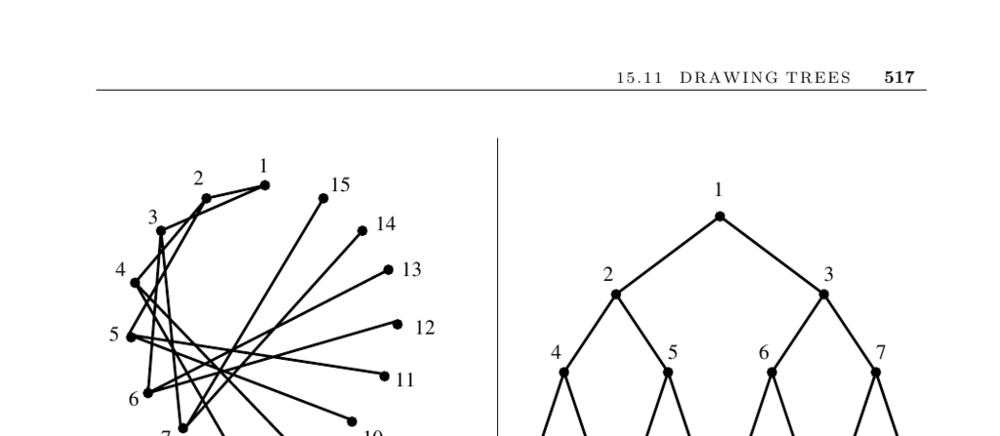

- **Drawing Trees**
  - **Input description**
    - The input is a tree T, defined as a graph without cycles.
    - The goal is to create a visually appealing drawing of T.
  - **Problem description**
    - Many applications require drawings of trees to display hierarchical structures.
    - Different aesthetics apply depending on the application context, e.g., family trees or phylogenetic trees.
  - **Rooted vs Free Trees**
    - Rooted trees have a hierarchical order with a single root node and must reflect this hierarchy in the drawing.
    - Free trees lack a designated root and represent only connection topology; thus, hierarchical drawings can be misleading.
    - The center vertex or vertices of a free tree can be used as a root for drawing purposes.
  - **Planar drawing and algorithms**
    - Trees are planar graphs and can be drawn without edge crossings.
    - Planar drawing algorithms exist but are often more complex than needed for tree drawings.
    - Spring-embedding heuristics work well for free trees but may be slow for some uses.
  - **Primary drawing methods for rooted trees**
    - Ranked Embeddings
      - Place the root at the top center and divide the page into vertical strips for each subtree.
      - Recursively draw subtrees within their strips, positioning new roots centrally and connecting to the parent.
      - Effective for hierarchical structures; however, subdivision can produce narrow strips leading to cramped vertices.
      - Adjust strip widths based on subtree sizes to improve spacing.
    - Radial Embeddings
      - Position the root or tree center at the drawing center.
      - Divide space into angular sectors for each subtree.
      - Make better use of space and appear more natural for free trees.
      - Use concentric circles to represent vertex ranking by distance from the center.
  - **Implementations and tools**
    - GraphViz is a widely used graph-drawing program that produces spline-based edge drawings.
    - Commercial tools include Tom Sawyer Software, yFiles, and iLOG’s JViews, many offering free trials.
    - Mathematica’s Combinatorica package provides several tree-drawing algorithms.
    - Further technical details are available in graph drawing literature, e.g., [Handbook of Graph Drawing and Visualization](https://graphdrawing.org) and books by Battista et al. and Kaufmann and Wagner.
  - **Research and complexity notes**
    - Tree layout heuristics have been studied extensively, with state-of-the-art algorithms dating from 2006.
    - Certain tree layout problems are NP-complete under specific aesthetic criteria.
    - Some tree layout algorithms arise from non-graph-drawing contexts, such as the Van Emde Boas layout improving memory performance.
  - **Related Problems**
    - Drawing graphs in general.
    - Planar drawings of graphs.
