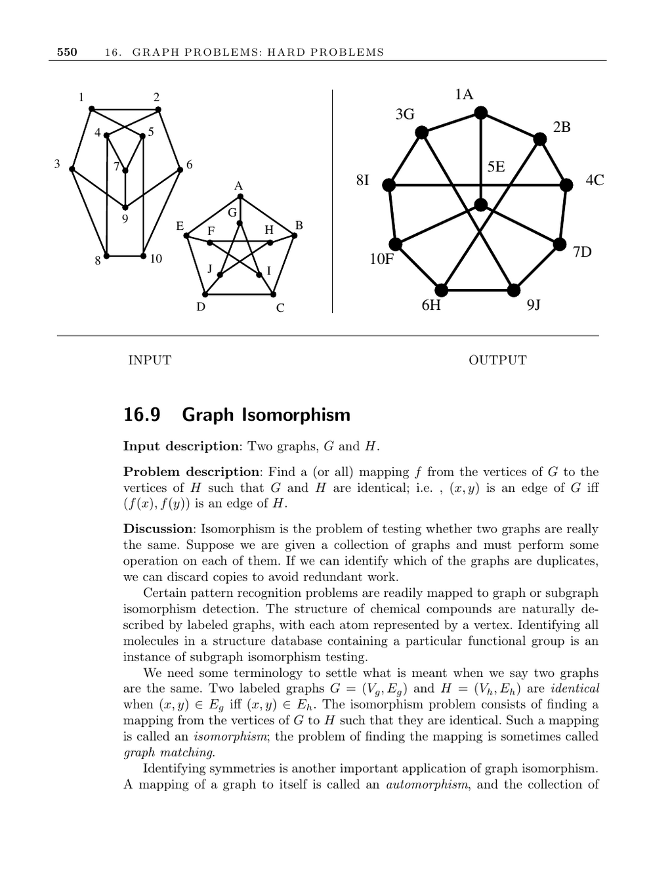

- **Graph Isomorphism**
  - **Problem Description**
    - Two graphs G and H are isomorphic if there is a mapping f from vertices of G to vertices of H preserving edges.
    - Isomorphism testing detects whether two graphs are identical in structure.
    - Applications include avoiding redundant operations on duplicate graphs and pattern recognition.
  - **Terminology and Variations**
    - An automorphism is a graph mapping to itself; the set of all automorphisms forms the automorphism group.
    - Variations include subgraph isomorphism, induced subgraph isomorphism, and labeled versus unlabeled graphs.
    - Different problem types influence complexity and applicable algorithms.
  - **Special Cases and Applications**
    - Tree isomorphism and planar graph isomorphism have specialized, faster algorithms.
    - Tree isomorphism algorithms work inward from leaves using labels and vertex degrees.
    - Graph isomorphism enables chemical compound structure analysis and graph database indexing.
  - **Computational Complexity**
    - The graph isomorphism problem is neither known to be solvable in polynomial time nor NP-complete.
    - Conventional wisdom places it in a complexity class between P and NP-complete if P ≠ NP.
    - Worst-case algorithms involve backtracking through permutations but include pruning heuristics.
  - **Equivalence Class Partitioning for Efficiency**
    - Preprocessing assigns vertices to equivalence classes using invariants like vertex degree.
    - Distance multisets from shortest path matrices further refine vertex partitioning.
    - Counting length-k paths via adjacency matrix powers provides additional vertex invariants.
  - **Implementations**
    - Nauty is a leading C language package for automorphism and isomorphism testing producing canonical forms.
    - VFLib is a graph-matching library implementing multiple isomorphism algorithms with performance benchmarks.
    - GraphGrep focuses on querying large graph databases efficiently.
    - Valiente provides C++ implementations for tree and graph isomorphism integrated with LEDA.
    - Kreher and Stinson offer group-theoretic C implementations for graph isomorphism and related operations.
  - **Notes and Further Reading**
    - Polynomial-time algorithms exist for planar graphs and bounded-degree graphs.
    - Distance-based heuristics were introduced by [Shapiro and Dinneen 1976].
    - Tree isomorphism linear-time algorithms are described in [AHU74].
    - The complexity of bipartite graph isomorphism is complete and equivalents are known.
    - See [McKay's Nauty](http://cs.anu.edu.au/~bdm/nauty/), [Valiente 2002](http://www.lsi.upc.edu/~valiente/algorithm/), and surveys such as [CH06].
