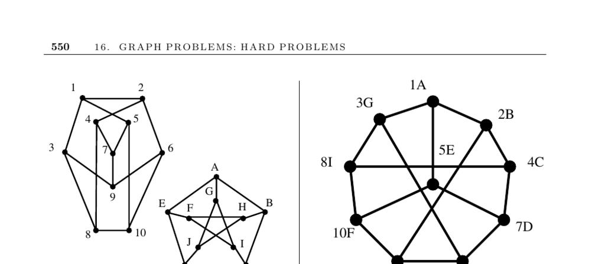

- **Graph Isomorphism**
  - **Problem Description**
    - The problem asks for a mapping between vertices of two graphs G and H such that edges are preserved exactly.
    - Identifying isomorphic graphs enables detection of duplicates to reduce redundant work.
    - Applications include chemical compound structure analysis and pattern recognition.
    - Definitions clarify that identical graphs have matching edges for corresponding vertices.
    - See [McK81] for theory and nauty's implementation details.
  - **Variations of Graph Isomorphism**
    - Subgraph isomorphism checks if graph G is contained within graph H as a subgraph.
    - Induced subgraph isomorphism requires both presence and absence of edges to match exactly.
    - Vertex and edge labels impact isomorphism mappings and can accelerate vertex pruning.
    - Special algorithms exist for trees and planar graphs, exploiting structural properties.
  - **Algorithms and Approaches**
    - Backtracking over vertex permutations is the basic approach, with pruning based on mismatches.
    - Preprocessing partitions vertices into equivalence classes using invariants like vertex degree and shortest paths.
    - Counting length-k paths via adjacency matrix powers helps refine vertex classification.
    - Tree isomorphism algorithms label leaves and work inward to identify equivalence classes efficiently.
    - See [AHU74] for a linear-time tree isomorphism algorithm.
  - **Practical Considerations and Implementations**
    - Highly symmetric graphs pose challenges due to limited effective vertex partitioning.
    - Nauty is a leading tool providing canonical labeling and fast automorphism group computations.
    - Other tools include VFLib for graph and subgraph isomorphism and GraphGrep for graph database mining.
    - Implementations by Valiente and Kreher & Stinson provide algorithmic and group-theoretic tools respectively.
    - Locations of software: [Nauty](http://cs.anu.edu.au/~bdm/nauty/), [VFLib](http://amalfi.dis.unina.it/graph/), [Valiente's code](http://www.lsi.upc.edu/~valiente/algorithm/), [Kreher & Stinson](http://www.math.mtu.edu/~kreher/cages/Src.html).
  - **Complexity and Theoretical Notes**
    - Graph isomorphism is neither known to be in P nor proven NP-complete.
    - The problem is conjectured to lie between these complexity classes if P ≠ NP.
    - Polynomial-time algorithms exist for planar graph isomorphism and graphs with bounded degree.
    - Bipartite graph isomorphism is isomorphism-complete; transforming graphs can preserve isomorphism status.
    - Consult [Hof82], [KST93], and [CH06] for surveys and complexity discussions.
  - **Related Problems**
    - Subgraph isomorphism, clique, independent set, and Hamiltonian cycle problems are connected variants.
    - Shortest path computations assist in vertex partitioning.
    - Tree isomorphism is closely related to string matching and parsing applications.
