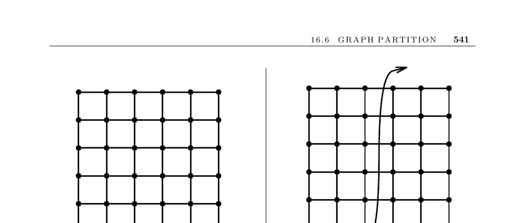

- **16.6 Graph Partition**
  - **Input description**
    - Input consists of a weighted graph G = (V, E) and integers k and m.
    - The goal is to partition vertices into m roughly equal-sized subsets.
    - The total edge cost spanning the subsets must be at most k.
  - **Problem description**
    - Partitioning aims to create roughly equal-sized pieces with minimal interconnecting edge costs.
    - This supports efficient divide-and-conquer, data locality, and cleaner visualizations.
    - Practical applications include clustering similar objects and parallel computations like finite element methods.
  - **Discussion**
    - Graph partitioning is NP-complete but heuristics yield practical solutions.
    - Special graph classes (trees, planar graphs) have guaranteed small separators to aid partitioning.
    - Variants include minimum cut set, balanced graph partition, and maximum cut, each with specific objectives.
  - **Basic heuristic approach**
    - Initial partitioning can be random or problem-specific.
    - Vertex movement decisions depend on neighbor distribution and are repeated to reach a local optimum.
    - Local optima may be far from global solutions; randomization (e.g., simulated annealing) improves results.
    - For multiple partitions, recursive application of heuristics is recommended.
  - **Spectral partitioning methods**
    - Use eigenvectors of the Laplacian matrix, especially the second-lowest eigenvector, for bisection.
    - Spectral methods locate good partition regions but benefit from local optimization refinement.
  - **Implementations**
    - Chaco provides multiple partitioning algorithms including Kernighan-Lin and spectral methods ([Chaco](http://www.cs.sandia.gov/~bahendr/chaco.html)).
    - METIS scales to graphs over 1,000,000 vertices and has variants for parallel and hypergraph partitioning ([METIS](http://glaros.dtc.umn.edu/gkhome/views/metis)).
    - Other implementations include Scotch ([Scotch](http://www.labri.fr/perso/pelegrin/scotch/)) and JOSTLE ([JOSTLE](http://staffweb.cms.gre.ac.uk/~wc06/jostle/)).
  - **Notes**
    - Fundamental heuristics derive from Kernighan-Lin and Fiduccia-Mattheyses algorithms.
    - Spectral methods are detailed in [Chu97, PSL90].
    - The planar separator theorem and efficient algorithms come from Lipton and Tarjan.
    - Random vertex partitions cut about half the edges on average.
    - Goemans and Williamson developed a 0.878-approximation algorithm for maximum cut using semidefinite programming ([Goemans-Williamson 1995](https://doi.org/10.1137/0222019)).
  - **Related problems**
    - Edge and vertex connectivity (see section 15.8).
    - Network flow problems (see section 15.9).
