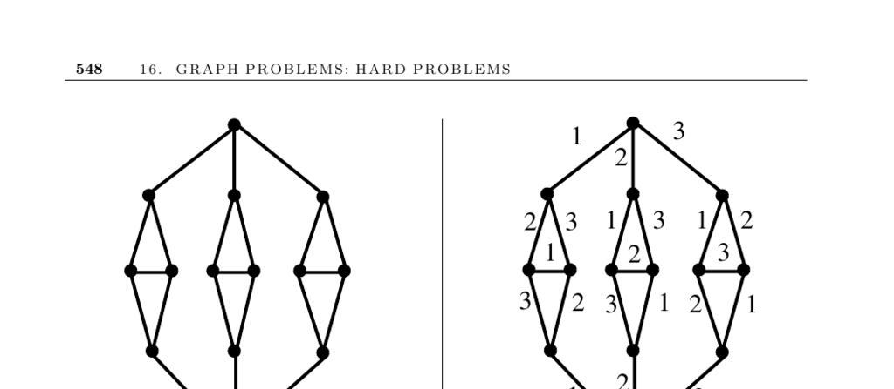

- **16.8 Edge Coloring**
  - **Input description**
    - The input is a graph \( G = (V, E) \) for edge coloring.
    - The task is to color edges so that no two edges sharing a vertex have the same color.
  - **Problem description**
    - Edge coloring schedules tasks by assigning colors to edges, representing non-conflicting events.
    - Each color corresponds to a distinct time period for simultaneous events.
    - Applications include scheduling interviews and NFL season games with constraints.
  - **Chromatic index and cycle properties**
    - The smallest number of colors for edge coloring is called the edge-chromatic number or chromatic index.
    - Even-length cycles require 2 colors, odd-length cycles require 3 colors.
  - **Vizing’s theorem**
    - Any graph with maximum vertex degree \(\Delta\) can be edge-colored using at most \(\Delta + 1\) colors.
    - At least \(\Delta\) colors are necessary since edges incident to one vertex must differ.
    - The theorem has a constructive proof leading to an \(O(nm\Delta)\) algorithm.
  - **Computational complexity**
    - Deciding if edge coloring can be done with fewer than \(\Delta + 1\) colors is NP-complete.
    - Bipartite graphs can be edge-colored in polynomial time.
  - **Line graph transformation**
    - Edge coloring can be converted into vertex coloring of the line graph \(L(G)\).
    - The line graph has vertices representing edges of \(G\), and edges representing adjacency at shared vertices.
    - Vertex-coloring algorithms apply on \(L(G)\), but this approach can be less efficient.
  - **Implementations and resources**
    - An implementation of Vizing’s theorem by Yan Dong is publicly available.
    - GOBLIN implements a branch-and-bound algorithm for edge coloring.
    - Combinatorica offers Mathematica edge-coloring via line graph transformations.
    - Further vertex-coloring algorithms are discussed in Section 16.7 (page 544).
    - Official resource links: [GOBLIN](http://www.math.uni-augsburg.de/~fremuth/goblin.html), Yan Dong’s implementation (http://www.cs.sunysb.edu/~algorith).
  - **Theoretical insights and notes**
    - Vizing and Gupta independently proved the upper bound of \(\Delta + 1\) colors.
    - Misra and Gries provided a simple constructive proof.
    - Whitney’s theorem relates line graphs uniquely to their original graphs, except for \(K_3\) and \(K_{1,3}\).
    - The line graph of an Eulerian graph is both Eulerian and Hamiltonian.
    - The line graph of a Hamiltonian graph is always Hamiltonian.
  - **Related problems**
    - Related to vertex coloring discussed in Section 16.7.
    - Connected to scheduling problems described in Section 8 (page 468).
  - **Further reading**
    - See [Vizing’s Theorem](https://en.wikipedia.org/wiki/Vizing%27s_theorem) for foundational theory.
    - Survey of edge coloring results: [FW77, GT94].
    - Computational hardness results: [Hol81].
    - Polynomial algorithms for bipartite graphs: [Sch98].
    - Whitney’s line graph work: [Whi32].
