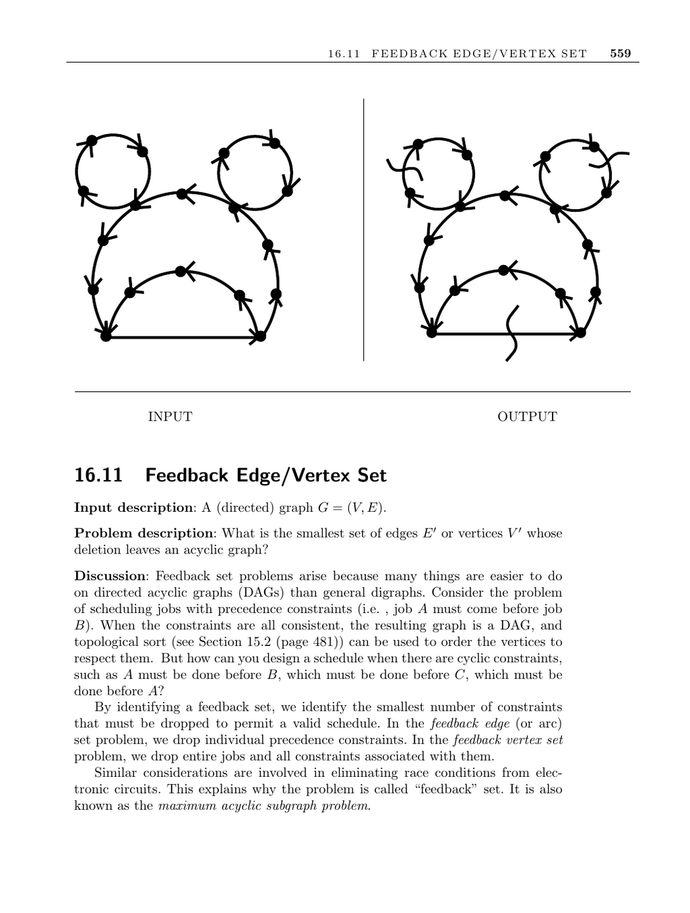

- **Feedback Edge/Vertex Set**
  - **Input description**
    - The input is a directed graph \(G = (V, E)\).
    - The problem focuses on identifying the smallest set of edges or vertices to delete to leave an acyclic graph.
  - **Problem description**
    - Feedback edge and vertex set problems determine the minimum deletions to achieve a DAG.
    - Dropping edges removes specific constraints; dropping vertices removes entire jobs and their constraints.
    - The problem is also known as the maximum acyclic subgraph problem.
  - **Discussion**
    - Feedback sets enable scheduling in graphs with cyclic constraints by removing contradictory edges or vertices.
    - The problem applies to eliminating race conditions in electronic circuits and ranking tournaments.
  - **Issues in feedback set problems**
    - Determining if constraints must be dropped can be done via topological sort.
    - Feedback edge sets can be found heuristically by ordering vertices and removing arcs going backward.
    - Vertex ordering strategies include sorting by edge imbalance and recursive partitioning based on edges from a chosen vertex.
    - Finding a feedback vertex set reduces to a vertex cover problem on back edges.
    - For undirected graphs, minimum feedback edge sets relate to back edges from depth-first search; feedback vertex sets remain NP-complete.
    - Heuristics for undirected feedback vertex sets delete vertices from the shortest cycles iteratively until acyclic.
  - **Refinements**
    - Improved heuristics use randomization or simulated annealing to explore permutations and candidate sets.
  - **Implementations**
    - GRASP heuristics for both feedback vertex and edge set problems are implemented in ACM Algorithm 815.
    - GOBLIN provides approximation heuristics for minimum feedback arc set.
    - Stanford GraphBase’s econ order program reduces adjacency matrices to acyclic graphs by deleting edges below the main diagonal.
  - **Notes and references**
    - Feedback set problems are NP-complete; hardness even persists with degree constraints.
    - Approximation algorithms exist: 2-factor for undirected feedback vertex sets and \(O(\log n \log \log n)\) for directed feedback edge sets.
    - Applications include ranking tournaments and economic sector ordering.
    - See [FPR99] for a survey and [BBF99] for undirected vertex set approximation.
