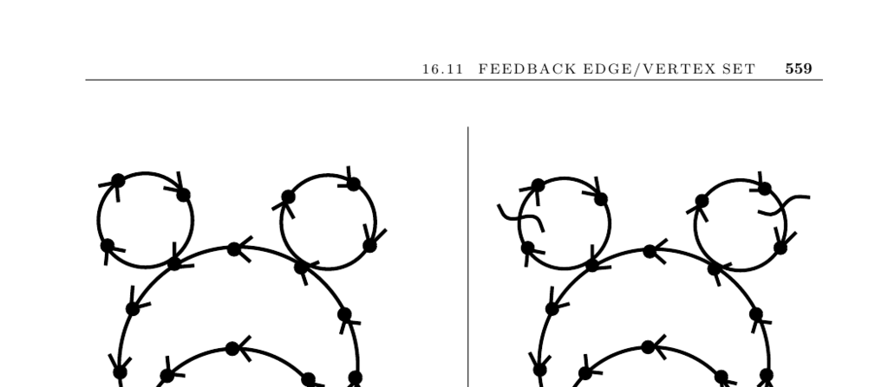

- **Feedback Edge/Vertex Set**
  - **Input Description**
    - The input is a directed graph G = (V, E).
    - The problem is to find the smallest set of edges or vertices whose removal results in an acyclic graph.
  - **Problem Description and Discussion**
    - Feedback sets identify the minimum constraints to drop to make scheduling with precedence constraints feasible.
    - Feedback edge sets remove individual edges; feedback vertex sets remove entire vertices with all incident edges.
    - The problem is also known as the maximum acyclic subgraph problem.
  - **Applications**
    - Scheduling jobs with precedence constraints benefits from feedback set identification.
    - Eliminating race conditions in electronic circuits motivates the feedback set terminology.
    - Ranking players in tournaments uses feedback edge sets to remove upsets and produce a topological order.
  - **Issues in Feedback Set Problems**
    - Detecting if constraints must be dropped is essential; a topological sort can confirm if the graph is already acyclic.
    - Simple feedback sets can be found by modifying topological sort but may be larger than optimal.
    - Linear-time heuristics construct vertex orders and delete edges going "backwards" to approximate feedback edge sets.
    - Feedback vertex sets correspond to vertex cover problems covering back edges.
    - For undirected graphs, feedback edge set is solvable by depth-first search back edges, but feedback vertex set remains NP-complete.
  - **Heuristic and Approximation Methods**
    - Vertex orders can be constructed via edge-imbalance sorting or recursive placement based on incoming/outgoing edges.
    - Feedback vertex set heuristics use BFS to find and delete shortest cycles until acyclicity is achieved.
    - Refinement of heuristics may employ randomization or simulated annealing.
  - **Implementations**
    - GRASP heuristics for feedback vertex and edge set exist, implemented in Fortran [FPR01].
    - GOBLIN includes approximation heuristics for minimum feedback arc set.
    - The Stanford GraphBase econ order program minimizes edges below the diagonal in adjacency matrices to find acyclic subgraphs.
  - **Notes and References**
    - Feedback set problems are NP-complete even with degree constraints [GJ79].
    - Approximations: 2-factor for undirected feedback vertex sets [BBF99]; O(log n log log n) for directed feedback edge sets [ENSS98].
    - Ranking tournament heuristics are detailed in [CFR06]; experiments in [Koe05].
    - Economic applications interpret feedback arc sets to order economic sectors by money flow [Knu94].
    - A survey on feedback set problems is in [FPR99]; foundational hardness proofs are in [AHU74, Eve79a].
