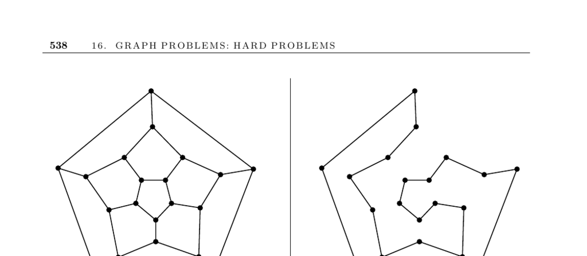

- **16.5 Hamiltonian Cycle**
  - **Input Description**
    - The input is a graph \( G = (V, E) \).
  - **Problem Description**
    - The goal is to find a tour visiting each vertex exactly once using only edges from \( G \).
    - This problem is a special case of the traveling salesman problem where edges in \( G \) have distance 1 and non-edges have distance 2.
  - **Discussion**
    - Hamiltonian cycle existence in \( G \) corresponds to a traveling salesman tour cost of \( n \) in the weighted graph.
    - The problems of finding longest paths or cycles are NP-complete even in restrictive unweighted graphs.
    - Longest path problems arise in pattern recognition where vertices represent symbols linking possible adjacent occurrences.
  - **Approach Strategies**
    - Allowing repeats of vertices turns the problem into an optimization problem that can be attacked by heuristics like simulated annealing or depth-first search spanning tree tours with at most \( 2n \) vertices.
    - Longest path in Directed Acyclic Graphs (DAGs) can be solved efficiently via dynamic programming by replacing min with max in shortest path algorithms.
    - Dense graphs always contain Hamiltonian cycles if all vertices have degree \( \geq n/2 \), enabling efficient cycle construction.
    - Reformulating vertex-tour problems as edge-tour problems may allow use of Eulerian cycle algorithms which are solvable in polynomial time.
  - **Exact Solutions and Implementations**
    - Backtracking with pruning is the only option to exactly determine Hamiltonian cycles in general graphs.
    - Testing biconnectivity can quickly rule out Hamiltonicity if articulation vertices are found.
    - Hamiltonian cycle can be reduced to symmetric TSP problems solvable by programs like Concorde, which is recommended for academic use ([Concorde TSP Solver](http://www.tsp.gatech.edu/concorde)).
    - The Vandegriend master’s thesis provides an effective exact code for Hamiltonian cycles, available at the University of Alberta website.
    - Surveys of TSP software including Hamiltonian cycle special cases are maintained at [TSP Software Page](http://www.or.deis.unibo.it/research_pages/tspsoft.html).
    - Stanford GraphBase’s football program employs a stratified greedy algorithm for longest-path problems in asymmetric directed graphs.
    - Enumeration of all Hamiltonian cycles can be done with backtracking routines by Nijenhuis and Wilf, or using Algorithm 595 from the ACM Collected Algorithms.
  - **Notes**
    - Hamiltonian cycles appeared historically in Euler’s knight’s tour and Hamilton’s 1839 “Around the World” game.
    - Good graph theory texts cover sufficiency conditions for Hamiltonian graphs, e.g., West [Wes00].
    - Biological computing methods like Adleman’s DNA computing solved small instances but scale exponentially and are impractical beyond approximately 70 vertices.
  - **Related Problems**
    - Related problems include Eulerian cycles and traveling salesman problems discussed elsewhere (Eulerian cycles page 502, TSP page 533).
