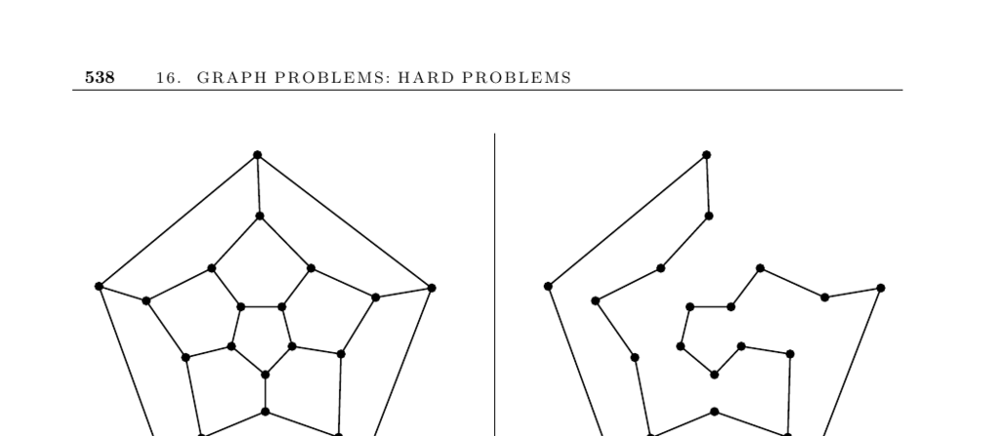

- **16.5 Hamiltonian Cycle**
  - **Input description**
    - The input is a graph \( G = (V, E) \).
  - **Problem description**
    - The goal is to find a tour visiting each vertex exactly once using only edges from \( G \).
    - This problem is a special case of the traveling salesman problem where edge distances in \( G' \) are 1 for edges present in \( G \) and 2 otherwise.
  - **Discussion**
    - Finding Hamiltonian cycles or paths is NP-complete even for restricted unweighted graphs.
    - The longest path or cycle problems appear in pattern recognition, with vertices representing symbols.
    - Possible approaches include heuristics, reformulating as optimization, dynamic programming for DAGs, and exploiting graph density.
    - Checking if the graph is bi-connected is critical since articulation vertices prevent Hamiltonicity.
    - Eulerian cycle problems are sometimes related and more tractable.
  - **Lines of attack**
    - Visiting vertices more than once can reformulate the problem to allow approximation using DFS and spanning trees.
    - Longest path in DAGs can be solved in linear time by adapting shortest path algorithms.
    - Dense graphs with all vertices degree \(\geq n/2\) are guaranteed Hamiltonian.
    - Differentiating between vertex-tour and edge-tour problems can guide problem reformulation.
  - **Implementations**
    - Hamiltonian cycles reduce to symmetric TSP solvable by Concorde, a leading TSP solver available at [Concorde](http://www.tsp.gatech.edu/concorde).
    - Vandegriend's master's thesis provides an effective Hamiltonian cycle program available online.
    - Surveys of TSP software by Lodi and Punnen are accessible at [TSP Software](http://www.or.deis.unibo.it/research pages/tspsoft.html).
    - Stanford GraphBase includes algorithms for related longest-path problems.
    - Efficient enumeration routines by Nijenhuis and Wilf and ACM's Algorithm 595 offer exact or heuristic backtracking methods.
  - **Notes**
    - Hamiltonian cycles originated in Euler’s knight’s tour and were popularized by Hamilton's 1839 game.
    - Comprehensive references on TSP and Hamiltonian cycles include [ABCC07], [GP07], and [LLKS85].
    - Texts like West [Wes00] review sufficiency conditions for Hamiltonicity.
    - Bio-computing approaches solve small instances but scale poorly due to molecular requirements.
  - **Related problems**
    - Eulerian cycle (page 502) and traveling salesman problem (page 533) are closely related problems.
