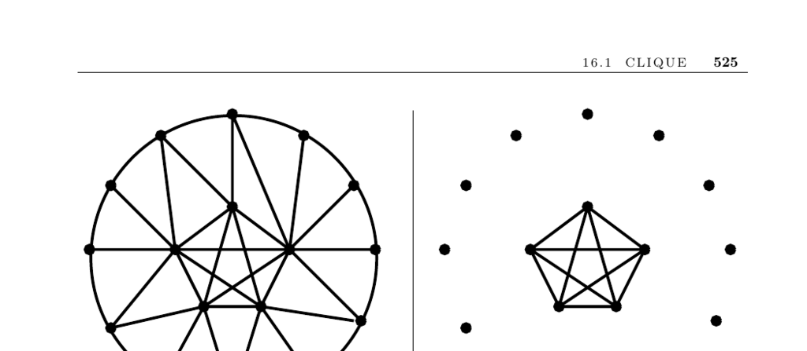

- **16.1 Clique**  
  - **Input description**  
    - The input is a graph G = (V, E).  
    - Vertices represent people or entities, edges represent relationships or connections.  
  - **Problem description**  
    - Find the largest subset S of vertices where every pair of vertices in S is connected by an edge.  
    - The subset S forms a clique, which is a complete subgraph.  
  - **Discussion**  
    - Cliques correspond to tightly connected social groups or suspicious entities in applications like tax fraud detection.  
    - Finding the maximum clique is NP-complete and hard to approximate within a factor of n^(1/2 - ε).  
    - A maximal clique can be found in O(n + m) time using a heuristic based on sorting vertices by degree.  
    - Large dense subgraphs offer alternatives to strict cliques by allowing some missing edges.  
    - Planar graphs limit clique size to at most four vertices; checking small cliques uses low-degree vertices.  
    - Exhaustive search with backtracking remains the only exact method for maximum cliques.  
    - Upper bounds on clique size rely on vertex degree ordering and pruning.  
    - Randomized heuristics like simulated annealing provide reasonable large-clique approximations.  
    - [Cliquer](http://users.tkk.fi/~pat/cliquer.html) is a C library using branch-and-bound for exact clique finding.  
    - DIMACS Implementation Challenge hosts diverse clique-finding programs and datasets.  
    - Branch-and-bound programs and heuristics are available from researchers like Kreher, Stinson, and software like GOBLIN.  
    - [Bomze et al. (1999)](https://link.springer.com/article/10.1023/A:1009954312806) provides a comprehensive survey on maximum cliques.  
    - The NP-completeness proof by Karp relates clique to vertex cover and independent set problems.  
    - Densest subgraph problems generalize clique detection by seeking subgraphs with high average vertex degree.  
    - Approximation hardness results come from Håstad (1982), showing strong limits unless P=NP.  
  - **Related Problems**  
    - Independent set problem (see page 528).  
    - Vertex cover problem (see page 530).
