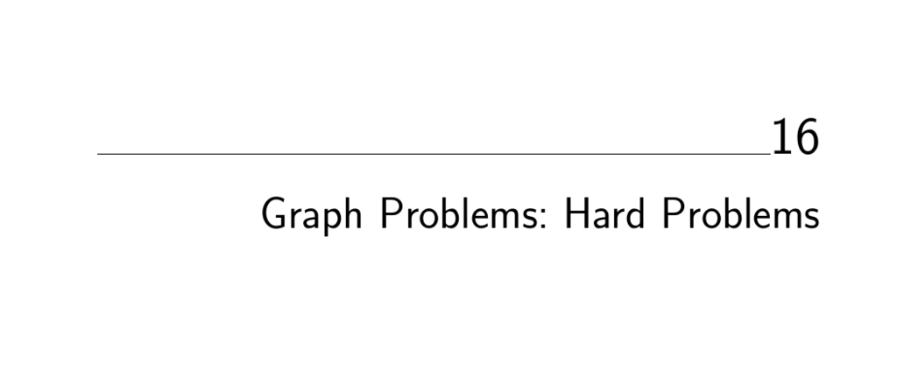

- **Graph Problems: Hard Problems**
  - All problems presented are NP-complete except graph isomorphism, whose complexity remains unknown.
  - NP-completeness theory equates the existence of polynomial algorithms across all such problems.
  - Recommended strategies include combinatorial search, heuristics, approximation algorithms, and algorithms for restricted instances.
  - Key references include [Garey and Johnson 1979](https://example.org), [Crescenzi and Kann 2003](http://www.nada.kth.se/~viggo/problemlist/), and others on approximation algorithms.

- **Clique**
  - Finds the largest subset of vertices all mutually connected in the input graph.
  - Maximum clique is NP-complete and hard to approximate within a factor of n^{1/2 - ε}.
  - Heuristics include finding maximal cliques, dense subgraphs, and special-case algorithms for planar graphs.
  - Exact solutions rely on backtracking with pruning using degree-based upper bounds.
  - Refer to implementations like Cliquer and GOBLIN; see [Bomze et al. 1999] for comprehensive surveys.

- **Independent Set**
  - Determines the largest vertex subset containing no edges between them in the graph.
  - Equivalent to the clique problem in the complement graph; also related to vertex coloring.
  - Simple heuristics select lowest-degree vertices iteratively to build a maximal independent set.
  - Polynomial solutions exist for special cases such as trees and bipartite graphs.
  - See clique-solving programs and GRASP heuristics by Resende et al. for implementations.

- **Vertex Cover**
  - Finds the smallest vertex subset covering all edges in the graph.
  - Equivalently formulates as set cover in restricted instances; closely related to independent set.
  - Greedy heuristic adds highest-degree vertices iteratively; guarantees a 2-approximation via maximal matching.
  - Dominating set and edge cover problems differ from vertex cover but are related.
  - Effective solvers like COVER and libraries like JGraphT include heuristics and approximations.

- **Traveling Salesman Problem**
  - Seeks a minimum cost cycle visiting each vertex exactly once in a weighted graph.
  - Variants depend on weight properties such as triangle inequality, symmetry, and graph completeness.
  - Heuristics include minimum spanning tree based tours, incremental insertion methods, and k-opt local improvements.
  - Optimal solvers like Concorde address large instances; PTAS exist for Euclidean cases.
  - Extensive references include [Applegate et al. 2007], [Arora 1998], and [Mitchell 1999].

- **Hamiltonian Cycle**
  - Determines whether a graph contains a cycle visiting each vertex exactly once.
  - It is a special NP-complete case of the traveling salesman problem with uniform costs.
  - Polynomial-time solutions exist for DAGs (longest path), but general graphs require backtracking.
  - Dense graphs with minimum degree ≥ n/2 are guaranteed to be Hamiltonian.
  - Solvers include Concorde TSP code and specialized backtracking algorithms like Vandegriend’s implementation.

- **Graph Partition**
  - Partitions graph vertices into m roughly equal subsets minimizing cross-partition edge cost.
  - Minimum cut disconnects graphs but may produce unbalanced partitions; balanced partitions are NP-complete.
  - Special planar and tree graphs have known small separators that guarantee balanced partitions.
  - Heuristics involve iterative vertex moves, local optimizations, spectral bisection based on Laplacian eigenvectors.
  - Leading tools include Chaco, METIS, Scotch, and JOSTLE; foundational works by Kernighan-Lin and Lipton-Tarjan.

- **Vertex Coloring**
  - Colors graph vertices using minimum colors so adjacent vertices differ in color.
  - Bipartite graphs are 2-colorable; planar graphs require at most 4 colors (four-color theorem).
  - Exact chromatic number computation is NP-complete; heuristics use incremental coloring and dynamic strategies like DSATUR.
  - Color interchange optimizations enhance heuristics; register allocation is a primary application.
  - Resources include Culberson’s coloring page and the Second DIMACS Implementation Challenge.

- **Edge Coloring**
  - Assigns colors to edges so no two edges sharing a vertex have the same color, minimizing total colors.
  - Vizing’s theorem ensures coloring with at most Δ+1 colors, where Δ is maximum vertex degree.
  - The problem reduces to vertex coloring of the line graph but direct algorithms are more efficient.
  - NP-complete to decide optimal edge-chromatic number beyond Vizing’s bound.
  - Implementations based on Vizing’s constructive proof exist; resources include GOBLIN and Combinatorica.

- **Graph Isomorphism**
  - Tests whether two graphs are identical via a vertex mapping preserving edges.
  - Problem complexity is unknown; neither known to be in P nor NP-complete.
  - Variants include subgraph isomorphism, labeled graph matching, and special cases like trees with efficient algorithms.
  - Equivalence classes based on invariants (degree, shortest paths) prune search space in backtracking.
  - Leading tools include nauty, VFLib, GraphGrep, and Valiente’s implementations; see [McKay 1981] for theory.

- **Steiner Tree**
  - Finds the minimal tree connecting a specified subset of vertices (terminals), possibly using intermediate points.
  - Differentiates from MST by allowing extra Steiner points; Euclidean, rectilinear, and graph variants exist.
  - Steiner tree is NP-hard; MST approximations offer guaranteed bounds (3/2 for Euclidean).
  - Geometric constraints provide candidate Steiner points through angle and degree conditions.
  - Recommended software includes GeoSteiner, FLUTE, and GOBLIN; phylogenic tree construction tools like PHYLIP and PAUP also relate.

- **Feedback Edge/Vertex Set**
  - Seeks the minimum set of edges or vertices whose removal makes a directed graph acyclic.
  - Applications include scheduling with precedence constraints, ranking tournaments, and race condition elimination.
  - Heuristics construct vertex orders minimizing backward edges; feedback vertex set reduces to vertex cover over back edges.
  - For undirected graphs, minimal feedback edge sets correspond to back edges in DFS; vertex set remains NP-complete.
  - Implementations include GRASP heuristics and tools like GOBLIN and Stanford GraphBase’s econ order; see [Festa et al. 1999].
